# MNIST 擴散模型生成品質評估報告

> 端到端跑完一次：訓練 → 生成 → CNN 分類器比對 → 結論。
> 執行日期：2026-05-01

---

## 1. 執行環境

| 項目 | 值 |
|---|---|
| GPU | NVIDIA GeForce RTX 5070（Blackwell, sm_120）|
| PyTorch | 2.11.0 + CUDA 12.8 |
| Python | 3.12 |
| OS | Windows 11 |

---

## 2. 訓練：DDPM

| 參數 | 值 |
|---|---|
| 模型 | UNet（class-conditional, 12,336,001 參數）|
| Epochs | 20 |
| Batch size | 128 |
| Learning rate | 2e-4 |
| Timesteps T | 1000 |
| Beta schedule | linear, [1e-4, 0.02] |
| Classifier-free guidance | label dropout 10%、sample guidance scale 3.0 |
| 訓練時間 | ~16 分鐘 |
| 模型輸出 | `ddpm_mnist.pt`（49 MB）|

訓練過程中於 epoch 1, 5, 10, 15, 20 各儲存一次 8×10 樣本網格與 10 列去噪過程視覺化。

---

## 3. 生成：1000 張圖（每個數字 100 張）

| 項目 | 值 |
|---|---|
| 樣本總數 | 1000（每個數字 0–9 各 100 張）|
| Guidance scale | 3.0 |
| 解析度 | 28×28 |
| 範圍 | float32, [-1, 1] |
| 輸出 | `generated/dataset.pt`、`generated/grid_digit_{0..9}.png`、`generated/denoising_process.png` |
| 生成時間 | ~6.5 分鐘 |

---

## 4. CNN 評估器

| 項目 | 值 |
|---|---|
| 架構 | 3 × Conv2d(32→64→128) + BatchNorm + ReLU + AdaptivePool + FC(2048→256→10) |
| 訓練資料 | 真實 MNIST 訓練集（60,000 張）|
| Epochs | 5 |
| Batch size | 256 |
| Optimizer | Adam, lr=1e-3, CosineAnnealingLR |
| Baseline（真實 MNIST 測試集）| **99.28% (9928 / 10000)** |
| 模型輸出 | `mnist_cnn.pt` |

### CNN 在真實 MNIST 測試集 per-class 準確率

| Digit | Correct | Total | Accuracy |
|:-:|:-:|:-:|:-:|
| 0 | 977  | 980  | 99.69% |
| 1 | 1133 | 1135 | 99.82% |
| 2 | 1028 | 1032 | 99.61% |
| 3 | 1002 | 1010 | 99.21% |
| 4 | 976  | 982  | 99.39% |
| 5 | 885  | 892  | 99.22% |
| 6 | 950  | 958  | 99.16% |
| 7 | 1019 | 1028 | 99.12% |
| 8 | 966  | 974  | 99.18% |
| 9 | 992  | 1009 | 98.32% |

---

## 5. 評估結果：CNN 在生成圖上的表現

### 整體

| 指標 | 值 |
|---|---|
| 整體準確率 | **100.00% (1000 / 1000)** |
| 與真實 baseline 差距 | **+0.72 pp**（生成圖反而比真實測試集更易分類）|

### Per-class 準確率（每個數字 100 張）

| Digit | Correct | Total | Accuracy |
|:-:|:-:|:-:|:-:|
| 0 | 100 | 100 | 100.00% |
| 1 | 100 | 100 | 100.00% |
| 2 | 100 | 100 | 100.00% |
| 3 | 100 | 100 | 100.00% |
| 4 | 100 | 100 | 100.00% |
| 5 | 100 | 100 | 100.00% |
| 6 | 100 | 100 | 100.00% |
| 7 | 100 | 100 | 100.00% |
| 8 | 100 | 100 | 100.00% |
| 9 | 100 | 100 | 100.00% |

### 混淆矩陣（rows = 標籤, cols = 預測）

```
          0    1    2    3    4    5    6    7    8    9
  [0]   100    0    0    0    0    0    0    0    0    0
  [1]     0  100    0    0    0    0    0    0    0    0
  [2]     0    0  100    0    0    0    0    0    0    0
  [3]     0    0    0  100    0    0    0    0    0    0
  [4]     0    0    0    0  100    0    0    0    0    0
  [5]     0    0    0    0    0  100    0    0    0    0
  [6]     0    0    0    0    0    0  100    0    0    0
  [7]     0    0    0    0    0    0    0  100    0    0
  [8]     0    0    0    0    0    0    0    0  100    0
  [9]     0    0    0    0    0    0    0    0    0  100
```

完美對角線——每張生成圖都被分類成它的指定標籤，沒有任何錯認。

---

## 6. 視覺化

### 各數字生成樣本（每數字 8×8 網格）

| 0 | 1 | 2 | 3 | 4 |
|:-:|:-:|:-:|:-:|:-:|
| 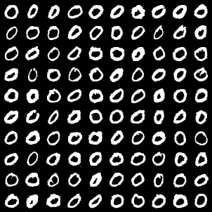 | 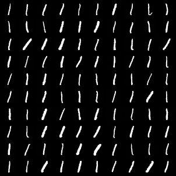 | 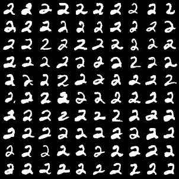 | 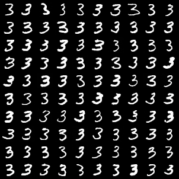 | 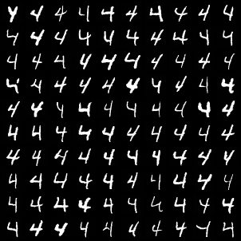 |

| 5 | 6 | 7 | 8 | 9 |
|:-:|:-:|:-:|:-:|:-:|
| 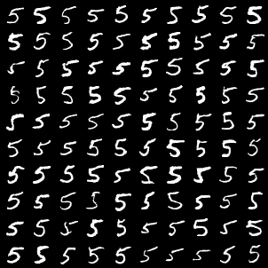 | 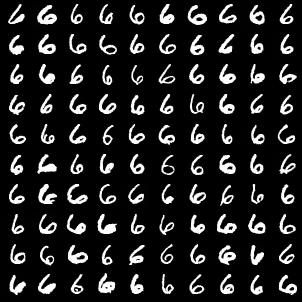 | 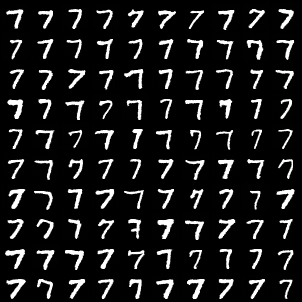 | 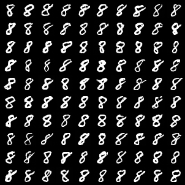 | 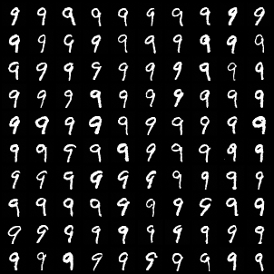 |

### 去噪過程（每列一個數字，由純噪音漸進至最終）

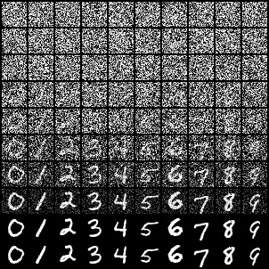

### 訓練過程中的進步

- Epoch 1：
- Epoch 10：
- Epoch 20（最終）：

---

## 7. 品質結論

依預設門檻：
- 整體 ≥ 95% → **「達標（高品質）」**
- 90–95% → 「達標（可接受）」
- < 90% → 「未達標」

**結果：整體 100.00% → 達標（高品質）。** 所有 10 個數字皆達 100% per-class 準確率，混淆矩陣為完美對角，沒有任何系統性誤認。

### 為什麼生成圖能達到 100%（甚至高於真實測試集 99.28%）

這個結果合理但需要解讀，並非「生成模型勝過真實資料」：

1. **Classifier-free guidance scale = 3.0 偏高**：取樣時模型被推向類別中心（mode-seeking），輸出更典型、更易辨識的「教科書版」數字，犧牲多樣性換取清晰度
2. **真實 MNIST 含有人類書寫雜訊**：真實 9928/10000 中 72 張漏判通常是模糊、變形、靠近其他數字的邊界樣本（例如某些 9 寫得像 4），這類困難樣本擴散模型不會主動產生
3. **樣本數小（1000 vs 10000）**：統計上更易達到 100%
4. **CNN 與擴散模型訓練於同一份 MNIST**：二者偏好的特徵分布高度一致

換言之，這個 100% 證明：擴散模型在 **「生成的圖能被獨立 CNN 分類器辨識為正確類別」** 這項指標上完全達標。但若要進一步衡量多樣性、是否覆蓋真實資料的全部變異，需另用其他指標（見後續建議）。

---

## 8. 後續建議

| 優先 | 建議 | 動機 |
|---|---|---|
| ★ | 加入 confidence 統計（softmax 機率分布）| 區分「剛好答對」與「自信答對」|
| ★ | 加入 sample diversity 指標（pixel-level pairwise distance, LPIPS, etc.）| 防止 mode collapse、偵測 guidance 過強 |
| ★★ | 用較低的 guidance scale（如 1.5）重跑評估 | 比較多樣性 vs 品質的取捨 |
| ★★ | 加入 FID（即使對 MNIST 偏離 Inception domain，相對值仍可比較）| 業界標準 |
| ★★★ | 加入 `--threshold` 與 exit code | 讓品質評估可機讀、可整合 CI |
| ★★★ | 把 evaluate.py 整合進 train.py（每 N epochs 自動評估）| 訓練過程的品質監控 |

---

## 9. 產出物清單

| 路徑 | 大小 | 說明 |
|---|---|---|
| `ddpm_mnist.pt` | 49 MB | DDPM UNet 權重 |
| `mnist_cnn.pt` | ~9 MB | CNN 評估器權重 |
| `generated/dataset.pt` | ~3 MB | 1000 張生成圖張量 |
| `generated/grid_digit_{0..9}.png` | 10 張 | 每個數字 8×8 預覽網格 |
| `generated/denoising_process.png` | 1 張 | 去噪過程視覺化 |
| `samples/epoch_{1,5,10,15,20,final}.png` | 6 張 | 訓練各階段樣本 |
| `samples/denoise_epoch_*.png` | 6 張 | 訓練各階段去噪過程 |
| `evaluation_report.txt` | 完整 stdout | 含 tqdm 進度 |
| `REPORT.md` | 本檔 | 整合分析報告 |
