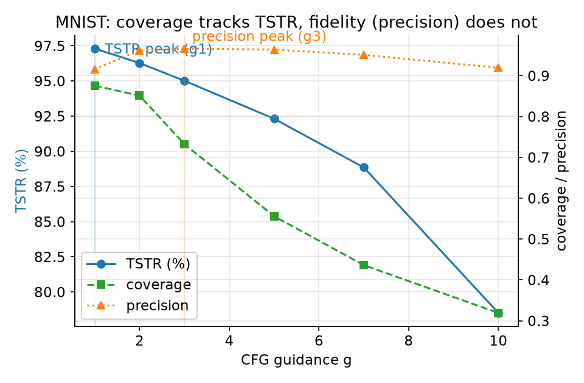
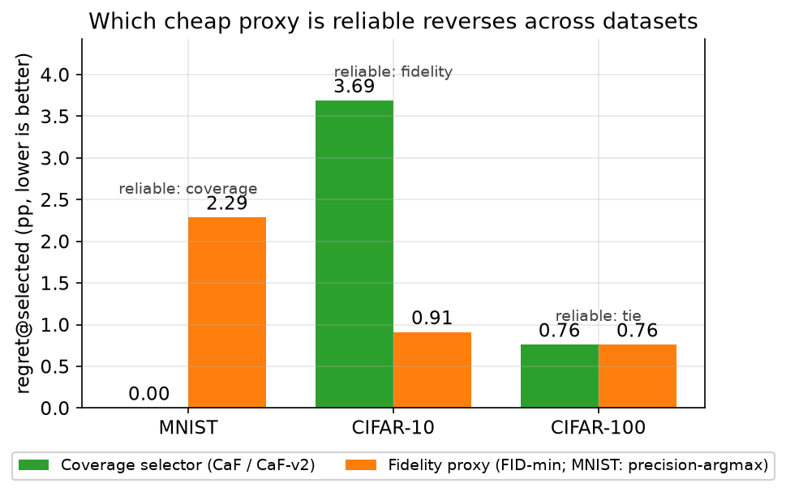
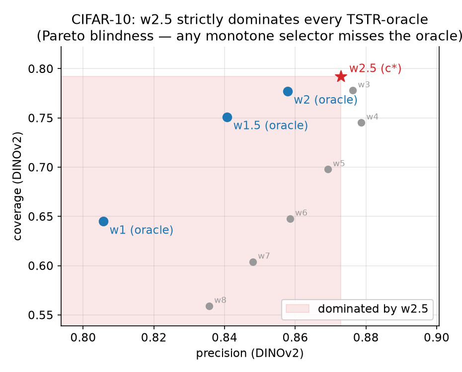
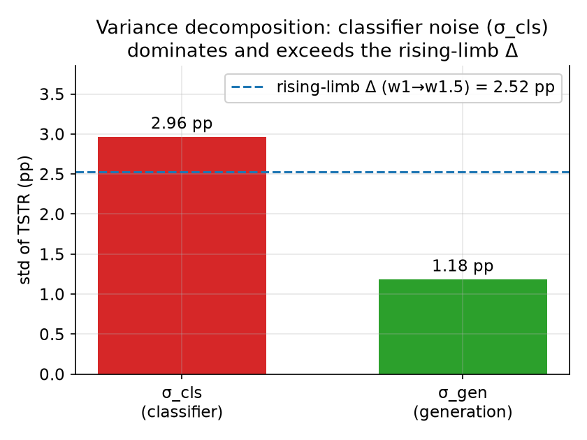
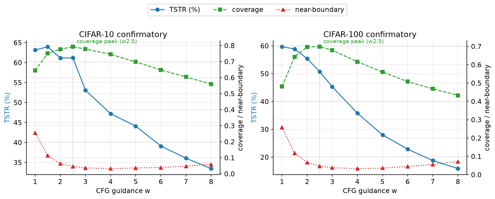
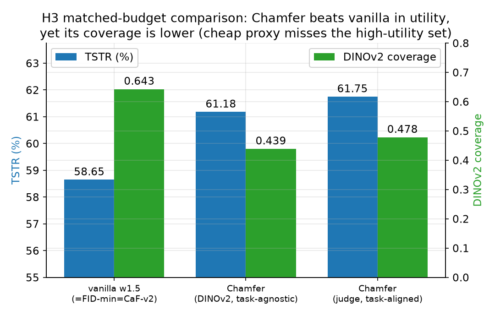

<!-- 用途：碩士論文完整草稿（分支三診斷論文，繁體中文）。整合自 docs 各稿；凍結證據（prereg_cifar100.md、verdict_cifar100.md）於附錄 A/B 逐字內嵌（僅標題層級下移，文字未改），論文自足。各節數據引 results/*.json、prose 引 CHANGELOG 錨點。撰寫狀態見文末「撰寫進度」。 -->

# 便宜代理何時可靠？合成訓練資料之取樣組態選擇的診斷研究

（英文題名：*When Is a Cheap Proxy Reliable? A Diagnostic Study of Sampling-Configuration
Selection for Synthetic Training Data*）

本檔為碩士論文完整草稿，依 CIFAR-100 揭盲裁決落定之分支三（診斷論文）撰寫。所有數據引 `results/*.json`
（本機、gitignore），prose 引 CHANGELOG 錨點；預註冊與揭盲裁決為凍結證據，於附錄 A/B 逐字內嵌、不改動凍結檔本身。
撰寫狀態見文末「撰寫進度」。

---

## 中文摘要

擴散模型生成的合成影像越來越常被當成下游分類器的訓練資料。選擇取樣組態（此處為 classifier-free
guidance 強度 w）時，一個自然的操作性問題是：能否用一個便宜的、免下游分類器的代理（保真度 FID、或
多樣性 coverage/precision）挑出下游訓練效用（Train-on-Synthetic-Test-on-Real, TSTR）最優的組態？本文
在三個尺度（MNIST、CIFAR-10、CIFAR-100）以預先登記的協定檢驗此問題，得到一個否定但可操作的結論：
沒有單一 coverage 型便宜代理能跨量測堆疊普遍可靠，惟便宜的 FID-min 反而近乎普適。coverage 選擇器
（judge 任務對齊特徵）在 MNIST 選中效用最優組態（regret 0）；在 CIFAR-10 上，它敗給更便宜的 FID-min
baseline（regret 3.69 對 0.91）；在 CIFAR-100 上與 FID-min 打平（兩者均為 0.76）。FID-min 則在三尺度皆
近乎最優（MNIST 實測 regret 1.02、與 oracle 相隔 1 格、依 C1 口徑不分離；原稱「MNIST 選錯」係
precision-argmax 代打之假影，已由實測 MNIST-FID 更正）。且 coverage「MNIST 可靠、CIFAR 失效」為「近可分
資料集 × 任務對齊特徵」之合取：完整 2×2 顯示 coverage-CaF 只在 MNIST+judge 成立，改變資料集或特徵空間
任一軸都失效；完整六格顯示 judge 每列皆低於 DINOv2（特徵效應恆正），即**特徵空間為主閘、資料集僅調節
幅度**（唯近可分之 MNIST+judge 精確中 oracle）。本文給出此不可靠
性的三個診斷來源——which-FID 交叉裁決（保真代理之可靠性表徵相依）、選擇器的 Pareto 失明引理（當
網格中存在同時支配所有 oracle 的組態時，單調選擇器結構性地選不到 oracle）、變異分解的功效意涵——並
報告 coverage 與 near-boundary 的雙段機制在最難的 CIFAR-100 仍可量測、仍複製
（但介入證據顯示其因果角色未獲支持）。與 Chamfer 的 matched-budget 對照另顯示：一個 guidance 方法
（Chamfer）產生的合成資料，下游效用高於任何 vanilla CFG 組態（其 coverage 於 224 量測空間反低、於導引
解析度反高——為量測解析度相依、非單向簡化假影，見 §5.6.1）。貢獻由「一個普適的免訓練選擇器」誠實地降為「coverage 型代理可靠性之
診斷——其可靠主由特徵空間閘定（任務對齊特徵為必要），資料集僅調節幅度——及其量測方法學，並附一個相對
普適的近最優便宜 baseline（FID-min）」。

**關鍵詞**：擴散模型、合成訓練資料、Train-on-Synthetic-Test-on-Real、classifier-free guidance、
取樣組態選擇、預先登記、Fréchet Inception Distance、coverage/precision、Pareto 失明。

## Abstract

Diffusion-generated synthetic images are increasingly used as training data for downstream
classifiers. When choosing a sampling configuration (here, the classifier-free guidance strength
w), a natural operational question is whether a cheap, downstream-classifier-free proxy (fidelity
via FID, or diversity via coverage/precision) can select the configuration that maximizes
downstream utility (Train-on-Synthetic-Test-on-Real, TSTR). We examine this question under a
pre-registered protocol across three scales (MNIST, CIFAR-10, CIFAR-100), and reach a negative
but operational conclusion: no single cheap proxy is universally reliable across datasets. The
same coverage selector picks the utility-optimal configuration on MNIST (regret 0), yet loses to
or ties the cheaper FID-min baseline on CIFAR-10 and CIFAR-100; conversely FID-min is near-optimal
on CIFAR but mis-selects on MNIST. We identify three diagnostic sources for this unreliability —
which-FID cross-adjudication (fidelity-proxy reliability is representation-dependent), a
Pareto-blindness lemma for the selector,
and the power implications of a variance decomposition — and report that the two-stage coverage /
near-boundary mechanism remains measurable and replicates on the hardest dataset, CIFAR-100
(though an intervention arm finds no support for its causal role). A matched-budget comparison
against Chamfer further shows that
a guidance method (Chamfer) yields higher downstream utility than any vanilla
CFG configuration; its coverage reads lower under our unidirectional simplified Chamfer and a
single seed, but the official bidirectional implementation reports the opposite (coverage rising),
so this lower-coverage reading may be a simplification artifact. The contribution is honestly demoted from "a universal training-free
selector" to "the dataset-dependence of proxy reliability and its measurement methodology."

**Keywords**: diffusion models, synthetic training data, TSTR, classifier-free guidance,
sampling-configuration selection, pre-registration, FID, coverage/precision, Pareto blindness.

---

## 目錄

- 第一章 緒論
- 第二章 背景與相關研究
- 第三章 方法
- 第四章 實驗設計與協定
- 第五章 結果
- 第六章 討論
- 第七章 結論與未來工作
- 參考文獻
- 附錄 A 預註冊全文（凍結檔逐字內嵌）
- 附錄 B 揭盲裁決全文（凍結檔逐字內嵌）
- 附錄 C Pareto 失明引理證明
- 附錄 D 主張與數據來源對照表
- 附錄 E 完整數據表

## 圖目錄

- 圖 5.1 MNIST：coverage 與 TSTR 同向、precision 峰錯位（`figures/fig_mnist.png`）
- 圖 5.2 三尺度選擇器判決反轉（`figures/fig_selector_reversal.png`）
- 圖 5.3 CIFAR-10 Pareto 失明：w2.5 支配所有效用最優組態（oracle）（`figures/fig_pareto.png`）
- 圖 5.4 變異分解 σ_cls 主導且大於上升肢 Δ（`figures/fig_variance.png`）
- 圖 5.5 CIFAR-10 與 CIFAR-100 雙段機制（`figures/fig_two_stage.png`）
- 圖 5.6 matched-budget 對照（H3）：Chamfer 勝 vanilla 但 coverage 反低（`figures/fig_h3_duel.png`）

（圖以 `make_thesis_figures.py` 由 `results/*.json` 產生；圖內文字為英文以避免中文字型缺字，圖說為中文。）

## 表目錄

表 5.1 MNIST sandbox 均值曲線；表 5.2 CIFAR-10 confirmatory 均值曲線；表 5.3 三尺度選擇器判決對照；
表 5.4 CIFAR-100 confirmatory 均值曲線；表 5.5 三臂對決（H3）；表 E.1–E.3 完整數據表。

## 符號表

| 符號 | 意義 |
|---|---|
| w | classifier-free guidance（CFG）強度，本文主掃軸（MNIST sandbox 早期記為 g，全文統一以 w 表示） |
| τ | CaF／CaF-v2 的 precision 門檻；auto-τ＝0.9 × real-vs-real precision 自動決定 |
| regret | regret@selected＝oracle 的 TSTR 減被選中組態的 TSTR，越低越好 |
| oracle | 某生成種子下 TSTR 最高（效用最優）的組態 |
| precision | PRDC 保真度：生成樣本落在真實流形內的比例 |
| coverage | PRDC 多樣性涵蓋：真實流形被生成樣本涵蓋的比例（本文選擇器核心訊號） |
| recall | PRDC 變體；CaF-v2 之第三訊號 |
| density | PRDC 變體 |
| near-boundary margin | 合成影像經 judge 分類器之機率 margin＝p(top1)−p(top2)，低於門檻者計為 near-boundary |
| p20 | 真實資料 margin 之低分位（20%），near-boundary 門檻校準點（0.3622） |
| σ_cls | TSTR 之分類器訓練變異（同一份合成資料重訓的標準差） |
| σ_gen | TSTR 之生成變異（不同生成種子的標準差） |
| MDE | 最小可偵測差（minimum detectable effect） |
| TSTR | Train-on-Synthetic-Test-on-Real，下游訓練效用 |
| FID | Fréchet Inception Distance，保真度量 |

---

# 第一章 緒論

## 1.1 研究背景與動機

擴散模型能生成逼真的影像，近年越來越常被拿來當成下游分類器的訓練資料：當真實標註資料稀缺、或有
隱私顧慮時，先訓一個生成模型、再用它產生大量合成影像來訓練分類器，是一條實際可行的路。此情境下有
一組必須決定的取樣旋鈕——去噪步數 steps、DDIM 的隨機性 η、以及 classifier-free guidance（CFG）的
強度 w——而這些旋鈕幾乎總是為了「讓影像更逼真」（最小化 Fréchet Inception Distance, FID）而調，背後
隱含一個假設：越逼真的影像就是越好的訓練資料。

本文聚焦 CFG guidance 軸，問一個具體的操作性問題：在只有一小份真實參考集、且手上沒有下游分類器的
情況下，能不能用一個「便宜的、免下游分類器」的代理，從候選的 guidance 組態中，挑出讓下游訓練效用
（Train-on-Synthetic-Test-on-Real, TSTR）最高的那個 w？這裡「便宜」有明確定義：代理只需要對一小份
真實影像算一次特徵統計（例如 FID，或流形式的 coverage/precision），不需要真的用合成資料去訓練任何
下游分類器、也不需要任務標籤。

這個問題有實務重量。若某個便宜代理可靠，實務上就不必為每一個新資料集或新任務，都重訓一個分類器、
掃一遍 guidance 再挑最好——只要算個 FID 或 coverage 就好。反之，若沒有這種可靠的便宜代理，那麼
「調 sampler 讓 FID 最小」這個預設做法，在「合成資料當訓練集」的情境下就沒有保證。本文檢驗的正是
這個需求能否被滿足，以及在什麼條件下能被滿足。

## 1.2 研究問題與貢獻

本文的核心問題是：**哪一個便宜代理可靠，這件事本身是否跨資料集普遍成立？** 本文原先假設一個正面
主張——效用最優偏離保真最優（FID≠效用）、且效用由多樣性 coverage 驅動，因此可用一個 coverage 導向的
免訓練選擇器 CaF 選中效用最優組態。這個主張在較難的資料集上被自家的預先登記資料逐步反證，論文因而
依預先登記的決策樹改走診斷定位。最終貢獻如下：

1. **經驗發現（主結果）**：coverage 型便宜代理的可靠性隨量測堆疊（特徵空間）變動，而便宜的 FID-min
   相對普適。coverage 選擇器（judge 特徵）在近可分的 MNIST 選中效用最優組態（regret 0），在較難的
   CIFAR-10 與 CIFAR-100 卻敗給或打平更便宜的 FID-min baseline；FID-min 則三尺度皆近最優（含 MNIST
   實測 regret 1.02、1 格不分離——原「MNIST 選錯」係 precision-argmax 代打之假影，T1a 已更正）。此
   「coverage 可靠與否」為「近可分資料集 × 任務對齊特徵」之合取（完整 2×2：只在 MNIST+judge 成立、
   特徵空間為主閘、資料集僅調幅度；T1b／T1c）。
2. **理論貢獻**：Pareto 失明引理。任何對 (precision, coverage) 單調遞增的選擇器，只要網格中存在一個
   組態嚴格支配所有效用 oracle，就在任何門檻下結構性地選不到 oracle——這不是校準問題，是選擇器形式
   本身的限制。
3. **方法學貢獻**：一套可重用的量測與檢定方法——預先登記協定與凍結四要件、變異分解與功效分析、
   which-FID 交叉裁決、共用選擇器同一份真實 probe 集計算的（matched-probe）FID-min 對決，以及機制的
   觀察量與介入設計。
4. **一個誠實的記錄**：便宜的 FID-min baseline 在 CIFAR 尺度常已近最優，任何更貴的選擇器都必須先
   勝過它才有存在理由。

明確不主張的部分：不主張任何普適的免訓練選擇器；不主張「FID≠效用」是本文的新發現（既有 guidance
與差分隱私擴散文獻已隱含此點，見 §2.4）；不主張 CaF／CaF-v2 有操作優勢（在 CIFAR 尺度它未勝更便宜的 FID-min）。

## 1.3 預先登記決策樹與本文定位

本文的可信度來自一個事前承諾：在看到 confirmatory 資料之前，就把「可能出現的結果」對應到「論文該長
成什麼樣子」，並照此決策樹走（完整版與 amendment 見 §4.2、附錄 B）。四分支揭盲決策樹（D1）以兩個
事前問題分岔——(一) 保真最優是否與效用最優「分離」（換一個 FID 特徵空間仍拉得開）？(二) 免訓練選擇器
CaF-v2 是否勝過更便宜的 FID-min baseline？——對應四種結果與論文形式：

1. 分離出現、且 CaF-v2 勝 FID-min → 原始主張的邊界條件復活（選擇器論文）。
2. 分離出現、但 CaF-v2 敗 → 主論點成立、選擇器主張不成立。
3. 不分離、但機制在最難尺度仍複製 → 診斷論文（定位「便宜代理何時可靠」）。
4. 皆否（不分離且機制不複製）→ 負結果短文。

CIFAR-100 confirmatory 揭盲後之客觀讀數為不分離、CaF-v2 與 FID-min 打平、機制三觀察量複製，唯一相容
分支三，本文即為此分支的診斷論文。先在緒論點明決策樹，是要讓讀者從一開始就理解：一篇報告「原始主張
被自家預先登記資料反證」的論文，仍是有計畫的科學，而非事後找補。

## 1.4 論文組織

本文其餘章節安排如下。第二章回顧擴散取樣旋鈕、TSTR 評估、生成品質度量（FID、FD-DINOv2、PRDC），
並定位相關工作。第三章給出問題形式化、CaF 與其修訂 CaF-v2 選擇器、機制與介入框架，以及 Pareto 失明
引理。第四章說明三尺度資料集、預先登記協定與凍結四要件、功效分析與逐位對帳的重現性設計。第五章
依序報告 MNIST、CIFAR-10、CIFAR-100 的結果、三個診斷來源、機制觀察與介入，以及matched-budget 對照。第六章
討論主結果（coverage 代理可靠性主由特徵空間閘定、資料集調幅度，FID-min 相對普適）、誠實負面、限制與相關工作差異化。第七章結論並列出未來工作。
附錄收預註冊與揭盲裁決（凍結證據，逐字內嵌）、引理證明、代號與主張／數據來源對照，以及完整數據表。

---

# 第二章 背景與相關研究

## 2.1 擴散模型與取樣旋鈕

擴散模型以一條前向加噪過程把資料逐步破壞成高斯噪聲，再學一個反向去噪過程把噪聲還原成資料。取樣時
有三個旋鈕與本文相關，這裡對初學讀者逐一說明它們是什麼、以及為什麼會影響合成資料的性質：

- **步數 steps 與隨機性 η（DDIM）**：steps 是反向去噪的步數（DDPM 需上千步，DDIM 把反向過程改寫為
  可跳步的常微分方程軌跡、數十步即可取樣，過少會引入離散化假影）；η 控制每步注入的隨機性（η=0 為
  deterministic 的 probability-flow ODE〔機率流常微分方程軌跡〕，η=1 且走滿步時退回 DDPM 的 ancestral
  sampling〔逐步注入隨機的原始祖先取樣〕），影響多樣性與逐樣本可重現性。
- **guidance 強度 w（CFG）**（MNIST sandbox 早期記為 g，本文統一以 w 表示）：classifier-free guidance
  以一個無條件與一個有條件預測的外插，控制取樣往指定類別集中的程度。提高 w 會把取樣分佈往該類別
  銳化（先去噪再銳化，denoise-then-sharpen）。銳化提升單張影像看起來的「典型性」與保真度，但同時抽走
  靠近決策邊界、低 margin 的非典型樣本。

  引用範圍界定（B&N）：Bradley & Nakkiran（2024）把 CFG 刻畫為 predictor-corrector，其極限為朝一個
  **gamma-powered 中間分佈**銳化——此為數學上明確的對象，**不等同**於直觀的「朝 class prototype 幾何
  中心集中」；本文用「prototype 集中」僅為機制直覺、非引用其定理。且該定理覆蓋的是**隨機 CFG_DDPM**，
  本文全程用 η=0 的 DDIM（deterministic），落在其分析範圍外；MNIST 上 η 對效用近乎無影響（η-null）之
  觀察，與「隨機性關鍵」一類預測存在張力，故本文不把 B&N 定理當作 η=0 尺度上機制之證明，僅作為銳化
  方向的動機。

本文的主張收緊在 guidance 軸 w：steps 與 η 的效用行為只在 MNIST sandbox 尺度做過（η 對效用近乎無
影響、steps 次要），CIFAR 尺度只掃 guidance，不宣稱三旋鈕的聯合曲面。

## 2.2 合成資料訓練與 TSTR

**Train-on-Synthetic, Test-on-Real（TSTR）** 是衡量合成資料下游效用的標準協定：只用合成影像訓練一個
分類器，再於真實測試集上量準確率。TSTR 反映的是「這批合成資料拿去訓練，實際有多好用」，與 FID 量的
「單張影像看起來多逼真」是兩件不同的事。本文以 TSTR 為效用的黃金標準，並問便宜代理能否在不算 TSTR
的前提下選中 TSTR 最優組態。

## 2.3 生成品質度量：FID、FD-DINOv2 與 PRDC

- **Inception-FID / clean-fid**：在 Inception 特徵空間量生成分佈與真實分佈的 Fréchet distance，是最
  通行的保真度量。本文以 clean-fid 的實作為標準錨點，並用它重現公開模型的數字作為量測正確性驗證。
- **FD-DINOv2**：把 FID 的特徵抽取器換成自監督的 DINOv2。文獻指出 DINOv2 特徵較貼近人類對品質的判斷，
  故本文用它作為第二個 FID 表徵空間，做 which-FID 的交叉裁決。
- **PRDC（precision / recall / density / coverage）**：流形式的生成指標。precision 近似保真度（生成
  樣本落在真實流形內的比例），coverage 近似多樣性涵蓋（真實流形被生成樣本涵蓋的比例），recall 與
  density 為其變體。coverage 是本文選擇器的核心訊號。

## 2.4 相關工作定位

**合成資料訓練的脈絡**。用生成模型產生合成影像來訓練下游分類器，動機是真實標註稀缺或隱私顧慮。
如何讓合成資料更「有用」（提升下游 TSTR），既有研究大致分三條路線：改變生成過程、給固定配方、以及
研究品質度量與下游效用的關係。本文屬第四種、更前置的操作點——在既有輸出上「選」組態，而非改生成。

**路線一：改變生成過程（須擁有並修改 sampler）**。此線在取樣迴圈內注入資訊使合成資料更有用，各法
改的東西、成本與操作點不同：

- **Chamfer Guidance**（Dall'Asen et al., NeurIPS 2025）：在取樣每一步加入朝真實 exemplar 的 Chamfer
  導引項，把生成分佈往真實流形推。改的是取樣梯度，成本是每步多一次特徵抽取與反傳；本文以簡化版
  Chamfer 作為 §5.6 對決之對手。
- **Feedback-guided Synthesis**（Askari Hemmat et al., TMLR 2024）：把下游分類器對合成樣本的回饋
  （如難例、類別失衡訊號）回饋到生成，偏向補強弱類。改的是條件／取樣分佈，需要一個下游分類器在迴圈中。
- **Deliberate Practice**（Askari-Hemmat et al., 2025）：以下游 learner 的預測熵動態導引生成，只產出
  最具資訊的困難樣本，改善合成資料的 scaling law。改的是「生成什麼」的動態排程，同樣需要訓練中的
  下游 learner。

三者共同點是**須擁有並修改 sampler、且多半需要一個下游分類器在迴圈中**；本文的操作點正交——免訓練、
不修改 sampler、只在既有輸出上選擇。

**路線二：固定配方**。Fan et al.（CVPR 2024）主張合成訓練用固定的低 CFG 值以保多樣性。這是一個不依
資料集的預設值；本文的問題恰是「這種便宜預設在不同資料集是否可靠」，並給出「哪個便宜代理可靠隨資料集
反轉」的量測證據。

**路線三：品質度量與下游效用的關係**。「保真度（FID）未必等於下游效用」的觀察並非本文首創，且有完整
先行文獻、非僅旁註：Ravuri & Vinyals（NeurIPS 2019，arXiv:1905.10887）系統性指出 FID／IS 並不預測
Classification Accuracy Score（CAS）——樣本品質度量與其作為訓練資料的效用可脫節，是「FID≠效用」最完整
的先行論文。差分隱私擴散的 Dockhorn et al.（DPDM，TMLR 2023，arXiv:2210.09929）則全文並列 FID 調參與
Acc 調參兩套 sampler 設定、並明示以取樣多樣性機制解釋兩者不同向（§5.2 指隨機取樣對 FID 關鍵、對下游
準確率影響較小），非「順帶」一提。**另一方向的先例**：Azizi et al.（TMLR 2023，arXiv:2304.08466）在
ImageNet 合成訓練上發現 FID 最優與 CAS 最優近乎重合（於 guidance≈1.25），即「FID-argmin 是好選擇器」的
正面先例——本文 T1a 於三尺度實測 FID-min 近最優、與此一致。上述 guidance 方法亦隱含 FID≠效用。本文不
宣稱此觀察為新發現，而聚焦其**可操作的後果**：能否用便宜代理事前選中效用最優組態，以及此事之可靠性
如何隨資料集與特徵空間變動。

**本文定位**。相對於上述須修改生成過程或給固定配方的工作，本文問一個更前置、更操作性的問題——
「在既有輸出上，哪個便宜代理能事前選中效用最優組態，以及這件事跨資料集是否可靠」。差異化不在於又一個
宣稱普適的選擇器，而在於**診斷方法論**：跨資料集的選擇器判決反轉、Pareto 失明引理、以及變異分解的
功效意涵。此外，本文的matched-budget 對照（第 5.6 節）顯示一個修改 sampler 的 Chamfer 在下游效用上勝過
任何 vanilla 組態；至於「其 coverage 反低、便宜代理排不到前面」的讀數，為量測解析度相依（§5.6.1：224 低、
導引解析度 112 反高；雙向重測仍低，故非單向簡化假影），列為條件觀察。

**與最接近的選組態工作差異化**。Astolfi et al.（2024，arXiv:2406.10429）以 PRDC 式的品質-多樣性前沿在
生成組態間做選擇，操作點與本文 CaF 最近；差異在於本文明確以 regret@selected 對照 downstream TSTR 評分、
並診斷該選擇之可靠性隨資料集×特徵空間變動（本文 2×2），而非假定前沿選擇普適可靠。

**其他相關工作（依主題，附 arXiv）**：合成訓練與 scaling——Sariyildiz et al.（CVPR 2023，2212.08420）、
Shipard et al.（CVPR-W 2023，2302.03298；CIFAR-10/100 多樣性 guidance）、Tian et al. StableRep
（2306.00984）與 SynCLR（2312.17742；guidance 之非單調內部峰）；guidance 技巧——CADS（2310.17347）、
Kynkäänniemi et al.（2024 guidance interval，2404.07724）、Karras et al.（autoguidance，2406.02507）；生成
度量——Kynkäänniemi et al.（2019 improved precision/recall，arXiv:1904.06991，本文 recall/precision 定義
出處）、Alaa et al.（2022，2102.08921）；near-boundary／margin 機制之學習理論根據（第六章機制章引用）——
Bartlett et al.（2017 spectrally-normalized margin bounds）、Sorscher et al.（2022 data pruning、beyond
neural scaling laws）。

---

# 第三章 方法

## 3.1 問題形式化

給定一個訓練好的條件式擴散模型與一組候選取樣組態（本文為 guidance 網格 w ∈ {1, 1.5, 2, 2.5, 3, 4,
5, 6, 7, 8}），每個組態可生成一份平衡的合成訓練集。令某組態的 TSTR 為其下游效用。對每個生成種子，
**oracle** 定義為該種子下 TSTR 最高的組態。一個**選擇器**只看便宜代理（不看 TSTR），從網格中挑一個
組態；其品質以 **regret@selected**＝oracle 的 TSTR 減被選中組態的 TSTR 衡量，越低越好，並輔以 top-k
命中率。我們用 regret 取代全域相關係數，因為後者容易被網格中的爛組態撐高而失去操作區辨力。

## 3.2 選擇器：CaF 與 CaF-v2

**CaF（Coverage-at-Fidelity）** 是本文最初提出的免訓練選擇器：對一小份真實 probe 集在特徵空間算每個
組態的 precision 與 coverage，選 `argmax coverage s.t. precision ≥ τ`。門檻 τ 由真實 probe 的
real-vs-real precision 乘一個比例自動決定（auto-τ＝0.9 × real-vs-real precision），因此不需要 TSTR、
不需要任務標籤，屬免訓練、免任務分類器。

CaF 在 CIFAR-10 網格上遇到一個結構性問題（第 3.4 節的 Pareto 失明）：存在一個高 guidance 組態同時在
precision 與 coverage 上支配所有效用 oracle，使得任何「coverage 越大越好」的選擇器都選不到 oracle。
一個離線探針顯示 recall 能打破此支配、而 density 不能。因此本文正式登記採用的（plan-of-record）選擇器改為
**CaF-v2＝`argmax recall s.t. precision ≥ τ`**：第三訊號改用 recall。關鍵是 recall 仍是對 DINOv2
特徵算的量、不引入任務 judge，因此「免任務標籤」的定位得以保住。本文後續以 CaF-v2 為 CIFAR-100 的
登記選擇器；凡提到原始 coverage 版一律標明 CaF。

## 3.3 機制與介入框架

本文提出並檢驗一條因果鏈作為「為什麼效用隨 guidance 這樣變」的機制假設：

> guidance 上升 → coverage 下降 → near-boundary 訓練樣本變少 → 下游分類器的 margin 變弱 → TSTR 下降。

**near-boundary** 以一個用真實資料訓練的分類器（judge）量測：對每張合成影像算機率 margin
（p(top1) − p(top2)），margin 低於一個校準門檻者即算 near-boundary。門檻以真實資料 margin 的低分位
（p20）校準。競爭機制自始內建為對照：低 guidance 會引入離類／模糊樣本（label-noise），這也會壓低
效用，必須與 coverage 機制區辨。

機制的檢定分兩層。**觀察層**以三個觀察量判斷雙段行為是否複製（見第 5.5 節）。**介入層**以
coverage-matched pruning 檢驗因果：把高 guidance 組態的合成集，剪除離真實流形最近的樣本、剪到低
guidance 組態的 coverage 水準，再重訓 TSTR；並以「移除等量的隨機樣本」為對照。若剪 coverage-carrying
樣本的 TSTR 代價顯著大於隨機剪枝，才支持 coverage 承載效用的因果角色。

## 3.4 Pareto 失明引理

**引理**：設組態 c\* 在 (precision, coverage) 平面上嚴格支配每個 TSTR-oracle o，即
precision(c\*) > precision(o) 且 coverage(c\*) > coverage(o)。則對任何門檻 τ，CaF
（`argmax coverage s.t. precision ≥ τ`）都不選任何 o。更一般地，任何形如
`argmax f(precision, coverage)`、f 對兩引數皆嚴格遞增的選擇器，在嚴格支配情形下都選不到 oracle。

其涵義是：CaF 的失效不是門檻沒調好（沒有任何 τ 能救），而是選擇器形式本身的限制。要脫離此盲點，
CaF-v2 必須引入第三個非單調的訊號（本文用 recall）或放棄單調性。完整證明（含空可行集 fallback 與
CIFAR-10 實例）見附錄 C。

## 3.5 量測方法學

本文的量測堆疊與其凍結是貢獻的一部分：PRDC 以 DINOv2 特徵為主、Inception 為 robustness；另算
FD-DINOv2 與 clean-fid 兩個 FID 空間。FID-min baseline 之 clean-fid 以 cleanfid 標準之**全訓練集** stats
計算（`clean_fid_vs_dataset`），與選擇器所用的小份真實 probe **並非同一份**；「matched-probe」是對此的
robustness 佐證、非實作——C7（[CHANGELOG 2026-07-09-06](CHANGELOG.md#2026-07-09)）以小 probe 排序穩定性
佐證 FID-min 排序在 probe 尺寸上穩健，但實作報告的是全訓練集 clean-fid。每個量測 driver 的輸出 metadata 強制記錄可重現所需的全部參數（nearest_k、有效 k=min(k, n−1)、
tau_fraction、batch、完整 argv、start_timestamp、torch/cuda/cudnn 版本），使任一 scalar 都能追溯到
其產生參數——這源於一次早期事故：一個 nearest_k 未被儲存的 scalar 無法被對帳，因而立下 metadata
完整性的規範。

## 3.6 量測與訓練細節（可複製規格）

本節把前述量測與訓練的實作細節寫到可複製的程度。除另註明外，所有實作見對應程式檔。

**PRDC（precision/recall/density/coverage）**（`metrics_prdc.py`）：以歐氏距離在特徵空間建全對距離
矩陣，對每個真實／生成樣本取第 k 個最近鄰半徑（排除自身）作為局部流形半徑。precision＝生成樣本落入
任一真實樣本 k-NN 球的比例；coverage＝真實樣本被最近的生成樣本落入其 k-NN 球的比例；recall 為對稱的
反向量；density 以落入計數除以有效 k 平均。**nearest_k＝5**（全專案一致），且對樣本數不足做夾擠
「有效 k＝min(nearest_k, n−1)」（見 §3.5 metadata）。跨類時逐類算再平均，樣本數少於 nearest_k+1 的
類別跳過。

**DINOv2 特徵管線**（`metrics_features.py`）：backbone 為 `dinov2_vitb14`（ViT-B/14），取 CLS token 之
768 維特徵；前處理把影像 clamp 到 [0,1]、以雙三次（bicubic）插值縮放至 224×224、再以 ImageNet 均值
標準差（mean (0.485,0.456,0.406)、std (0.229,0.224,0.225)）正規化；灰階自動擴為三通道。coverage 量測
用 224 解析度；Chamfer 導引時的可微分特徵另用較低解析度（見下）。

**clean-fid / Inception-FID**（`fid_clean.py`）：直接呼叫 `cleanfid` 套件（Parmar et al., 2022）之
Inception-V3 特徵，作為量測正確性的公開錨點（CIFAR-10 base 8.95、CIFAR-100 base 11.226 @50k）。

**TSTR 分類器**（`cifar_classifier.py`）：架構為 CIFAR 版 ResNet-18（3×3 stem、無初始 maxpool、四階段
[64,128,256,512]、512 維 penultimate）。訓練用 SGD（momentum 0.9、nesterov、weight_decay 5e-4）、
cosine annealing、初始 lr 0.1、batch 128；資料增強為隨機水平翻轉＋反射 padding 4 後隨機 32×32 裁切。
每個組態的合成訓練集為平衡生成：CIFAR-100 每類 500 張（共 50,000 張）、CIFAR-10 confirmatory 每類
1000 張。每個 cell 以 5 個獨立 from-scratch 分類器重訓（reps=5，`run_cifar_cfg_multiseed.py` 凍結值），
TSTR epoch＝15，取均值後餵選擇器（此為 D4 功效配置之基礎）。

**judge 分類器與 near-boundary 校準**（`cifar_judge.py`）：judge 同為 ResNet-18，於真實訓練集全量訓練
（CIFAR-100 每類 500、共 50,000 張，epoch 25），真實測試準確率 74.25%。near-boundary 以機率 margin
＝p(top1)−p(top2) 定義；門檻取真實測試集（全 10,000 張）margin 分布的第 20 百分位（p20），得
**0.3622**（`--quantile 0.20`），此時真實資料 near-boundary 比例約 20%、中位 margin 未飽和（約 0.91），
確保 CIFAR-100 的 near-boundary 量測不因 judge 過度自信而退化。

**Chamfer 基線**（`chamfer.py`、`run_cifar100_h3_duel.py`）：於 DDIM 每步對預測的乾淨影像 x0 施加朝
真實 exemplar 的 Chamfer 導引——目標為 coverage 項（每個 exemplar 到最近生成樣本距離之均值），對 x0
取梯度、以 −chamfer_weight×grad 為位移併回 DDIM 更新。matched-budget 對照設定：chamfer_weight＝1.0、每類 16 個
exemplar、guidance_scale＝1.0（純條件、無 CFG 銳化）、逐類對同類 exemplar 導引；主結果用任務無關的
DINOv2 特徵（導引時縮放至 112 解析度），對照組用任務對齊的 judge penultimate 特徵。matched-budget 為
seed 10、每類 500 張（共 50,000 張）、reps=3；FID-min 與 CaF-v2 兩臂沿用凍結 confirmatory 之 w1.5 值，
僅 Chamfer 臂重新生成。

---

# 第四章 實驗設計與協定

## 4.1 三尺度資料集

本文在三個難度遞增的尺度上檢驗同一個問題：

- **MNIST（近可分 sandbox）**：類別近乎線性可分，真實資料本身的 near-boundary 質量極少（約 0.9%）。
  作為最低成本的乾淨案例，驗證機制方向與選擇器可行性。
- **CIFAR-10**：10 類自然影像，非可分。confirmatory 主場之一。
- **CIFAR-100**：100 類、每類僅 500 張訓練影像，更難、非可分。是全案的科學承重牆——CIFAR-10 結論的
  獨立複製由它回答。

## 4.2 預先登記協定與凍結四要件

為避免看過資料後才調整判準（HARKing），本文對 CIFAR-100 的 confirmatory 採**預先登記**：在任何
confirmatory 合成樣本生成之前，把假設、指標、網格、選擇器、功效配置與 go/no-go 判準全部以 prose
寫死、隨 repo 發布（全文見附錄 A，git 提交時間可驗證早於真跑）。三個原始登記假設與其 go/no-go 門檻
（D0、D4，逐字見附錄 A）如下：

- **H1（機制）**：驅動下游效用（TSTR）的是 coverage（多樣性）而非 fidelity（precision）。
  通過判準：三項揭盲觀察量（D3）三中二成立即判機制複製。**結果：複製（3/3）。**
- **H2（選擇器）**：免訓練的 CaF／CaF-v2 能在候選組態中選到近效用最優者（regret@selected 低）。
  通過門檻（D4）：CaF-v2 之 per-seed regret 至少比 matched-budget FID-min baseline 低 1.5pp。
  **結果：不成立（實得差 0.00pp，與 FID-min 打平）。**
- **H3（對決）**：在相同生成預算（張數）下對照（matched-budget），CaF 選 vanilla 組態的下游準確率
  打平或優於簡化 Chamfer。**結果：被 Chamfer 反超（Chamfer 勝 vanilla +2.54pp，見 §5.6）。**

一個「凍結」的規格須同時滿足四要件才算數：(a) 規則寫在版控文件的 prose；(b) 涉及計算者寫進版控程式；
(c) 於已揭盲資料上通過 dry-run；(d) 輸出對凍結目標做雜湊或逐位對帳。CIFAR-100 因每類僅 500 張，無法
沿用 CIFAR-10 的 1000/class 匹配口徑，故以 amendment 於揭盲前登記 per-class＝real-per-class＝500，並
明記「coverage 絕對值跨資料集不可直接比較」為已登記限制。

**四分支決策樹（D1）** 事前把可能結果對應到論文形式：(1) 分離出現且 CaF-v2 勝 FID-min → 邊界條件
復活；(2) 分離但 CaF-v2 敗 → 主論點成立、選擇器主張不成立；(3) 不分離但機制複製 → 診斷論文；(4) 皆否 →
負結果短文。本文最終落分支三（見第 5.3 節與附錄 B）。

## 4.3 功效分析與變異分解

在做峰位偏移這類細峰主張前，必須先知道雜訊有多大。變異分解（C4）把 TSTR 的變異拆成分類器訓練變異
σ_cls 與生成變異 σ_gen：CIFAR-10 上 σ_cls=2.963pp 主導 σ_gen=1.182pp 約 2.5 倍。這意味著任何小於約
2.5pp 的效用差，在少數 seed 下都無法解析。據此，CIFAR-100 的功效配置定為 8 seed × 5 rep（最小可偵測
差 MDE 2.49pp），足以解析約 2.5pp 的峰位偏移；H2 的通過門檻也據此定為「CaF-v2 的 per-seed regret
至少比 FID-min 低 1.5pp」。診斷的一部分正是**指出何種主張在何種功效下不可證**。

## 4.4 重現性：P0/P1 逐位對帳與種子公式

為確保數字可信，本文對生成到量測的路徑做決定性對帳。P0 對單一 cell、P1 對全部 30 個 config 做
streaming 重生成，並即時對帳：全部 30 config 的量測對帳 scalar（precision、coverage 之 DINOv2 與
Inception 兩側、char_clean_fid、near-boundary、label-noise）逐位重現凍結 JSON。TSTR 因含未種子化的
shuffle 為非決定性，明文不列入對帳集、不宣稱逐位重現。種子以 hash 派生
`gseed(seed, w)=int(sha256(f"{seed}_{w:g}")[:15], 16)`，全網格枚舉驗證無碰撞（此為修正 CIFAR-10 舊
公式在本網格退化碰撞的問題）。

---

# 第五章 結果

本章為觀察性描述，凡機制相關敘述一律避免因果措辭。各數據表逐一對照對應的 `results/*.json`。

## 5.1 MNIST sandbox：coverage 驅動效用、CaF 選中 oracle

設定：DDIM、η=0、steps=50、guidance w ∈ {1, 2, 3, 5, 7, 10}、每類 1000 張、seeds {0, 1, 2}、
auto-τ ≈ 0.857。數據 `results/selector_signal.json`（單 seed）、均值曲線
`results/selector_signal_multiseed.json`。

**表 5.1 MNIST sandbox 均值曲線**（三 seed 均值，源自 `results/selector_signal_multiseed.json`）

| w | precision | coverage | TSTR% | near-boundary |
|---|---|---|---|---|
| 1 | 0.916 | 0.875 | 97.30 | 0.0269 |
| 2 | 0.961 | 0.851 | 96.28 | 0.0008 |
| 3 | 0.966 | 0.732 | 95.01 | 0.0001 |
| 5 | 0.964 | 0.556 | 92.31 | 0.0 |
| 7 | 0.951 | 0.436 | 88.85 | 0.0 |
| 10 | 0.919 | 0.319 | 78.51 | 0.0 |

觀察：coverage 隨 guidance 單調下降（0.875→0.319），TSTR 也單調下降（97.30→78.51），兩者近乎完美
同向；而 precision 在 w3 達峰（0.966）、TSTR 卻在 w1 達峰。故一個 **precision-argmax** 驅動的代理會選到
w3 一帶而選錯，coverage 驅動的 CaF 則三個 seed 全選中 oracle w1，regret 0.00±0.00、rank 1/6、top-3
命中 100%。此為「coverage 可靠、precision-argmax 不可靠」的乾淨案例（限 precision-argmax：實測 MNIST
FID-min 反而選 g2、近最優 regret 1.02、與 oracle 相隔 1 格，見 §6.1 之 T1 補充，故不宜推廣為「fidelity 在
MNIST 皆不可靠」）。限制：MNIST 近可分，真實資料 near-boundary
質量僅約 0.9%，機制的強證據需留待更難的 CIFAR-100（[CHANGELOG 2026-07-03-02](../CHANGELOG.md#2026-07-03)）。

**圖 5.1**　MNIST（多 seed 均值）：coverage 與 TSTR 隨 guidance 同向單調下降，precision 在 w3 達峰
而 TSTR 在 w1 達峰。一個 fidelity/precision 驅動的代理會選到 w3 一帶而選錯，coverage 驅動的 CaF
選中 oracle w1。（`results/selector_signal_multiseed.json`）

## 5.2 CIFAR-10 confirmatory：三判決

設定：steps=50、η=0、grid {1, 1.5, 2, 2.5, 3, 4, 5, 6, 7, 8}、fresh seeds {10, 11, 12}、per_class
1000。三判決互不裁決、分立定稿（[CHANGELOG 2026-07-09-03](../CHANGELOG.md#2026-07-09)）。

解讀以下選擇器判決，需要先備兩把尺（完整實例見第 5.4 節）：其一是 **Pareto 失明**——當網格中存在一個
在 (precision, coverage) 上同時支配所有效用 oracle 的組態時，任何對兩者單調的選擇器都結構性地選不到
oracle（引理見 §3.4、CIFAR-10 實例見 §5.4.2）；其二是**雜訊地板**——TSTR 的變異分解顯示分類器訓練
標準差 σ_cls 約 2.5pp，任何小於此的效用差在少數 seed 下不可解析（見 §5.4.3）。前者解釋「為何 CaF
結構性選不到 oracle」，後者解釋「為何某些細峰主張『不可判定』」。

**判決一（原始主結果被反證）**：FID-opt 與 TSTR-opt 重合於 w1.5（clean-fid 均值 8.82、TSTR 均值
63.96），排序 ρ(−char_clean_fid, TSTR)=0.964。which-FID 交叉裁決（C1）：FD-DINOv2 的 argmin=w2、
TSTR 的 argmax=w1.5，相隔 1 格；疊加 Inception 側 0 格——依凍結口徑（>1 格才算分離）兩表徵空間皆
不分離。「內部最優」（上升肢 w1→w1.5 +0.80pp、SE 1.88）在 3 個生成 seed 下不可判定（此雜訊水準見
§5.4.3 變異分解），「必然次優」的全稱句撤下。

**判決二（機制相關，偏相關裁決）**：全網格偏相關 partial ρ(TSTR, coverage | precision, label-noise) 於
DINOv2 側 +0.658（p=0.0188）、Inception 側 +0.859（p=0.0008），機械通過；但沿種子軸的 bootstrap CI
跨零、可交換性受 gseed 碰撞影響，穩健性須由 CIFAR-100 獨立複製回答（並由無碰撞重跑 v2 直接回應——
partial ρ(TSTR,coverage|precision)=+0.526、p=0.058，同向、n=10 功效有限，見 §5.2.1）。顯著亦不寫
「coverage 驅動效用」的因果句。

**判決三（selector，描述性）**：更便宜的 FID-min 之 per-seed regret 0.91（2.45 / 0.28 / 0.00）勝
CaF 3.69（0.54 / 5.03 / 5.49），為 3 seed 2 勝 1 負（seed10 上 CaF 0.54 反勝 FID-min 2.45）。CaF 於
本網格結構性 Pareto 失明（見第 5.4.2 節）。可辯護的措辭是：CaF 能穩定避開效用崩潰的高 guidance 區
（避免選到最差組態），但無法在近最優區內精確定位最佳組態；而更便宜的 FID-min 同樣能避開崩潰區，
且計算成本與 CaF 相同。（無碰撞重跑 v2 見 §5.2.1：FID-min regret 降為 0.00、三 seed 全勝，CaF 升為
6.70——v1 的「2 勝 1 負」與 oracle 漂移主為種子碰撞假影，方向不變且更強。）

**表 5.2 CIFAR-10 confirmatory 均值曲線**

| w | 1 | 1.5 | 2 | 2.5 | 3 | 4 | 5 | 6 | 7 | 8 |
|---|---|---|---|---|---|---|---|---|---|---|
| TSTR | 63.16 | 63.96 | 61.16 | 61.19 | 53.08 | 47.20 | 44.10 | 39.10 | 36.06 | 33.46 |
| coverage(DINOv2) | .645 | .751 | .777 | .792 | .778 | .745 | .698 | .648 | .604 | .559 |
| precision | .806 | .841 | .858 | .873 | .876 | .879 | .869 | .859 | .848 | .836 |
| near-boundary | .256 | .114 | .063 | .046 | .037 | .032 | .037 | .039 | .048 | .059 |
| ln_excess | +.044 | −.038 | −.057 | −.062 | −.065 | −.065 | −.065 | −.064 | −.063 | −.062 |
| FD-DINOv2 | 282.4 | 195.2 | 175.4 | 176.7 | 188.7 | 223.9 | 261.1 | 302.6 | 341.9 | 379.4 |

（表中 ln_excess＝label-noise 相對基準之超出量〔label_noise_excess_mean〕，正值表該組態的離類／模糊
樣本比例高於基準、負值反之。`results/cifar10_cfg_confirmatory.json`、`results/cifar10_c6_fidmin_duel.json`；
FD-DINOv2 列為三 seed 均值，源自 `results/cifar10_p1_streaming.json`。全 30 config 量測 scalar 逐位對帳、
k=5 獲探針反證，[CHANGELOG 2026-07-09-01](../CHANGELOG.md#2026-07-09)。）

### 5.2.1 無碰撞重跑（confirmatory v2）

§5.1 的舊生成種子公式 `seed*1e7+int(w*1e3)*1e4` 在本網格退化：30 個 cell 只得 14 個相異 gseed、
26 個 cell 共用 latent，破壞 seed 獨立性。依 `docs/amendment_cifar10_v2.md`（登記早於重跑）以無碰撞
hash 種子、reps 由 1 提為 5 重跑（其餘凍結規格一律不動），得 v2（`cifar10_cfg_confirmatory_v2.json`、
`cifar10_c6_fidmin_duel_v2.json`）：

- **FID-min regret 降為 0.00（三 seed 全中 oracle；v1 為 0.91、2 勝 1 負）**；CaF regret 升為 6.70
  （v1 3.69）；C1 分離格步 0/3 全不分離（v1 為 1/1/0）。
- **oracle 三 seed 穩定於 w1.5**（v1 漂移 w2/w1/w1.5）——v1 的漂移與 FID-min 殘餘 regret 主為種子碰撞
  ＋單 rep 噪聲之假影，無碰撞後 FID-min 完全等於 oracle。
- **Pareto 失明更清晰**：oracle w1.5（TSTR 65.59）之上，w2.5 於 coverage（.792 ≥ .749）與 precision
  （.869 ≥ .842）雙雙支配、而其 TSTR（56.61）為網格最差之一，故單調 CaF 選 w2.5、得 regret 6.70。
- C2 偏相關 partial ρ(TSTR,coverage|precision)=+0.526、p=0.058（同向、未達，n=10 功效有限）；§5.2 判決二
  「可交換性受碰撞影響」之保留於 CIFAR-10 亦由此重跑直接回應。

判決方向不變（便宜的 FID-min 勝 coverage-CaF）且更強。v1 保留凍結（其數字與既有引用不動、仍在對帳集），
正文之 CIFAR-10 confirmatory 主張以 v2 為準；v1 與其碰撞問題見本節與 `docs/amendment_cifar10_v2.md`。

## 5.3 CIFAR-100 confirmatory 與 D1 揭盲路由

設定：steps=50、η=0、grid 同上 10 點、seeds {10..17}（8 seed）、reps 5、per_class＝real_per_class＝
500。揭盲裁決全文為凍結證據，見附錄 B 與 `docs/verdict_cifar100.md`。

三項客觀觀察量（皆自凍結的 `results/cifar100_cfg_confirmatory.json` 純衍生）：

- **C1（which-FID）不分離（Inception，路由依據）**：Inception clean-fid 的 argmin=w1.5、TSTR 的
  argmax=w1，相隔 1 格；逐 seed 分離格步 >1 的數目 0/8。判不分離——此為 D1 揭盲路由之依據（凍結，
  Inception-only）。事後補算之 seed-10 FD-DINOv2（§5.4.1）在 DINOv2 空間反而判分離（argmin w2.5、3 格），
  屬凍結範圍之外、不回改路由，且強化「連用哪個 FID 空間都無普適答案」的診斷。
- **H2（selector）打平**：CaF-v2（recall）與更便宜的 FID-min 逐 seed regret 完全相同
  （[0.79, 1.15, 0.45, 0.87, 0.67, 0.73, 0.91, 0.52]，兩者均值各 0.76pp、同選 w1.5、oracle 皆 w1）。
  H2 通過門檻（D4）要求 CaF-v2 之 regret 至少比 FID-min 低 1.5pp，實得差 0.00pp，selector 主張不成立。
- **H1（機制）複製**：三項揭盲觀察量（D3）全數成立（3/3，見第 5.5 節）。

四分支決策樹唯一相容分支三（診斷論文）：branch 1/2 需分離、branch 4 需機制不複製，皆被資料排除。
作者於 2026-07-17 簽核此揭盲路由（[CHANGELOG 2026-07-17-03](../CHANGELOG.md#2026-07-17)）。此為 MNIST／
CIFAR-10 之後第三個資料點，CIFAR-100 與 CIFAR-10 同型（FID-min 近最優），非 MNIST 那型（coverage
主導、CaF 選中 oracle）。

**表 5.3 三尺度選擇器判決對照**

| 資料集 | TSTR-oracle | coverage 選擇器選中 | coverage 選擇器 regret | FID-min regret | fixed-w1 regret | fixed-w2 regret | random-feasible regret | 可靠的便宜代理 |
|---|---|---|---|---|---|---|---|---|
| MNIST | w1 | w1 | 0.00 | 1.02（實測 g2、1 格） | 0.00 | 1.02 | 5.92 | coverage（CaF 選中 oracle） |
| CIFAR-10 | 依 seed | w2.5 | 3.69 | 0.91（2 勝 1 負） | 1.71 | 3.71 | 15.66 | FID-min |
| CIFAR-100 | w1 | w1.5 | 0.76 | 0.76（打平） | 0.00 | 4.27 | 22.82 | FID-min（更便宜） |

（MNIST：coverage 選擇器 `selector_signal.json`、FID-min `mnist_fid_arm.json`（T1a 實測 g2、1 格）；
CIFAR-10：`cifar10_c6_fidmin_duel.json`；CIFAR-100：
`cifar100_c6_fidmin_duel.json`；fixed-w／random-feasible 三欄：`baseline_fixed_random.json`。
MNIST 的 fixed-w1／fixed-w2 即 guidance 1.0／2.0；fixed-w 全欄逐 w 之 per-seed regret 見 JSON，
表中僅列網格邊界 w1 與文獻慣例值 w2，w1.5 即 FID-min 欄，因 FID-min 在 CIFAR 網格恆選 w1.5。）

判讀——coverage 選擇器（judge 特徵）在近可分的 MNIST 可靠、在較難的 CIFAR 失效。但 FID-min 經實測
在三資料集皆近最優（MNIST regret 1.02、與 oracle 相隔 1 格、依 C1 口徑不分離）：原「FID-min 在 MNIST
會選錯」係先前以 precision-argmax 代打之假影，T1a 實測（選 g2）已更正，故 FID-min 並不隨資料集反轉。
真正隨設定變動的是 coverage 選擇器——T1b 顯示把 MNIST 換到與 CIFAR 相同的 DINOv2 特徵堆疊後，MNIST 的
coverage 亦轉為非單調（峰在 g2）、CaF 也選錯（regret 1.02）。完整六格 2×2（§6.1）顯示反轉主由**特徵空間**
閘定、資料集調幅度——任務對齊 judge 特徵下 coverage-CaF 之 regret 三尺度皆小，唯近可分 MNIST 精確中
oracle、CIFAR 差 1 格（反轉歸因詳見 §6.1）。預註冊 D5 的兩個
下限 baseline 補報於右三欄：CaF 與 FID-min 在三資料集都遠勝「隨機可行點」（在該 seed 可行集內均勻
抽一組態的期望 regret，CIFAR-100 22.82pp、CIFAR-10 15.66pp、MNIST 5.92pp）。固定 w1（網格邊界）在
MNIST 與 CIFAR-100 為 0.00——因兩者的 TSTR-oracle 恰落在網格最低的 w1；但固定 w 不是自適應選擇器，
在 oracle 隨 seed 變動的 CIFAR-10 上固定 w1 為 1.71、劣於 FID-min 的 0.91。w1 邊界是否為真最優，仍待
更低 guidance（w<1）的探索釐清，列為限制。

**圖 5.2**　三尺度選擇器 regret 對照（越低越好）。coverage 選擇器（CaF／CaF-v2）在 MNIST regret 0、
在 CIFAR-10 敗於更便宜的 FID-min、在 CIFAR-100 與其打平；FID-min 則三尺度皆近最優（MNIST 1.02、
CIFAR-10 0.91、CIFAR-100 0.76）。變動的是 coverage 選擇器的可靠性、非 FID-min。（MNIST 保真代理欄為
T1a 實測 MNIST FID-min，選 g2、regret 1.02，`results/mnist_fid_arm.json`。）

## 5.4 診斷來源：為何沒有便宜代理普遍可靠

### 5.4.1 which-FID 交叉裁決：可靠性表徵相依（C1）

若「保真最優偏離效用最優」成立，換一個 FID 的特徵空間或許能救。CIFAR-10 上 FD-DINOv2 與 Inception
兩空間的 FID-argmin 都與 TSTR-argmax 相鄰或重合（格步 1 與 0），依凍結口徑皆不分離——換表徵空間也不
拉開，兩個 FID 空間都是尚可的效用代理。

CIFAR-100 的答案更尖銳：**兩個 FID 空間給出相反判決**。Inception clean-fid 逐 seed 0/8 不分離（argmin
w1.5、離 TSTR-argmax w1 僅 1 格），作為選擇器 regret 約 0.8pp、近最優；但 seed-10 的 per-config
FD-DINOv2（`results/cifar100_fd_dinov2.json`）之 argmin 落在 w2.5、離 TSTR-argmax w1 達 3 格、**判分離**，
作為選擇器會選中多樣性已崩的 w2.5、regret 約 8.8pp。即在 CIFAR-100 上，Inception-FID 追得上效用、
DINOv2-FID 追不上——**連「用哪個 FID 空間」都沒有普適答案**。此不復活原始的普適「FID≠效用」主張
（Inception-FID 在此仍是好代理），而是把「無普適便宜代理」推進一層：代理的可靠性連在保真度量的表徵
選擇上都是相依的。

範圍與凍結：CIFAR-100 之 D1 揭盲路由（附錄 B，凍結）以 confirmatory 之 Inception 空間（0/8 不分離）為據
並經作者簽核；本節之 FD-DINOv2 為**事後、單 seed（10）** 之補算，超出凍結 verdict 之 Inception-only 範圍、
不回改該路由。FD-DINOv2 之 argmin 為 w2-w2.5 之平底盆（153.8 對 153.6），多 seed 複製列未來工作。

**C1 的第二把尺（配對統計，事後補充）**：上述「相隔幾格」是凍結格步口徑（路由依據，不回改）；但
「不分離」不等於「無偏移」。以標準配對檢定（`results/c1_paired_stats.json`，post-hoc）量化
「TSTR-argmax 組態對 FID-argmin 組態」的 per-seed TSTR 配對差：CIFAR-100 八 seed 為 [0.79, 1.15,
0.45, 0.87, 0.67, 0.73, 0.91, 0.52]、均值 0.76pp、配對 t=9.71（p≈2.6e-5）、符號檢定 8/8 正。偏移
系統性存在、方向符合原假說（FID-min 系統性少挑一點 TSTR），但幅度 0.76pp 實務可忽略，且 TSTR-argmax
恆落在網格邊界 w1（其是否為真最優，待 w<1 探索釐清）。兩把尺並列的結論一致：Inception-FID 在
CIFAR-100 既判「不分離」（格步口徑）又僅有「可忽略的系統偏移」（配對口徑），皆支持它為此尺度堪用的
效用代理；配對檢定的顯著性來自 8×5 的高功效，不改任何凍結判決，只補充解讀。CIFAR-10 因僅 3 seed、
方差大，同一配對檢定不顯著（均值 0.91pp、t=1.18、p=0.36）。

**τ 校準的樣本數配平（seed 10，事後）**：判決三的 τ 由 real-vs-real 半分（250v250）定，但各 config 的
precision 量在 500v500，兩者樣本數不一致——樣本數越少、precision 系統性越高（真實流形越稀、k-NN 半徑越
大）。以 seed 10 快取之 DINOv2 特徵把量測改在 250v250（`results/tau_sensitivity.json` 之
`matched_calibration_seed10`；其 500v500 欄逐位重現 frozen precision）：oracle w1 的 precision 由 0.78
（500v500，低於 τ=0.7945、被 floor 擋掉）升為 0.8106（250v250、通過 floor），CaF-v2 遂由 w1.5（regret
0.79）翻回 oracle w1（regret 0.00）。即「CaF-v2 平 FID-min」至少在 seed 10 部分是量測與校準樣本數不一致
的假影；完整 8 seed 之配平需 GPU 重算 gen 特徵，列補充。此為事後補充、不改凍結之 500v500 路由。

### 5.4.2 Pareto 失明引理實例（C8）

CIFAR-10 confirmatory 均值中，w2.5（precision .873、coverage .792）嚴格支配三個 per-seed oracle——
w2（.858, .777）、w1.5（.841, .751）、w1（.806, .645）。依第 3.4 節引理，CaF 在此網格結構性選中 w2.5、
選不到 oracle，且無任何 τ 能救。recall／density 離線探針（C0）（`results/cifar10_recall_density_c0.json`）測得 **recall 可
打破 w2.5 的支配**（w2.5 recall .493 低於三 oracle 的 .528 / .555 / .579）、density 不能，故 CaF-v2
的第三訊號改用 recall。但這只解 CIFAR-10 的特定支配，不改「無普適代理」的結論——CIFAR-100 上
CaF-v2(recall) 仍與 FID-min 打平。

**圖 5.3**　CIFAR-10 的 (precision, coverage) 平面。w2.5（星號，c\*）在 precision 與 coverage 兩軸皆
高於三個 TSTR-oracle（w1、w1.5、w2，落在陰影支配區內），構成嚴格支配。故任何對 (precision,
coverage) 單調的選擇器（含 CaF）在此網格結構性選不到 oracle，且無任何 τ 能救。
（`results/cifar10_recall_density_c0.json`）

### 5.4.3 變異分解的功效意涵（C4）

`results/cifar10_c4_variance.json`：σ_cls=2.963pp 主導 σ_gen=1.182pp 約 2.5 倍。CIFAR-10 上升肢
w1→w1.5 的效用差（+2.52pp）小於 σ_cls，在少 seed 下不可解析。這說明「內部最優」等細峰主張在此雜訊
水準下不可判定——診斷的一部分是指出何種主張在何種功效下不可證，也是 CIFAR-100 功效配置定為 8×5 的
由來。

**圖 5.4**　CIFAR-10 的 TSTR 變異分解。分類器訓練變異 σ_cls＝2.96pp 主導生成變異 σ_gen＝1.18pp
（約 2.5 倍），且大於上升肢 w1→w1.5 的效用差 Δ＝2.52pp（虛線）。故此細峰效應在少 seed 下落在雜訊
內、不可解析。（`results/cifar10_c4_variance.json`）

**協定強化（T9）**。以 train-on-real 上限線與 epochs 消融進一步坐實此雜訊地板為協定內生
（`results/tstr_real_ceiling.json`、`results/tstr_protocol_ablation.json`）：

- **real 上限線**：train-on-real TSTR＝CIFAR-100 70.75（epochs 15）／76.22（50）、CIFAR-10 64.78／79.46；
  合成最佳（w1 59.44／w1.5 58.71）距 15-epoch 上限約 6–11pp。真實訓練本身於 CIFAR-10 由 15→50 epochs 大漲
  （64.78→79.46），顯示 15-epoch 協定尚未訓足。
- **epochs 消融（seed10）**：cell 排序**隨 epochs 翻轉**——15 epochs 下 w1（59.96）> w1.5（58.66），50 epochs
  下 w1.5（61.52）> w1（61.34），w2.5 恆最差。即「oracle 為 w1」是 15-epoch 協定相依；訓足至 50 epochs 後
  oracle 反成 w1.5——**恰為 FID-min 之選中組態**，與 §5.2.1 之 v2「FID-min 即 oracle」一致。w1 與 w1.5 之差
  落在 σ_cls 內（各 cell σ_cls 0.2–0.9pp），故選擇器賴以區分兩者的細峰在協定噪聲之下。此為「噪聲地板為協定
  內生」之直接證據：TSTR 的 15-epoch 訓練不足既放大 σ_cls、又使精細排序不穩。

## 5.5 機制觀察與介入（CIFAR-100）

診斷之外，本文報告一個正面的觀察性結果：coverage 與 near-boundary 的雙段行為，在最難的 CIFAR-100 仍
可量測、仍複製。均值曲線（`results/cifar100_cfg_confirmatory.json`）：

**表 5.4 CIFAR-100 confirmatory 均值曲線**

| w | 1 | 1.5 | 2 | 2.5 | 3 | 4 | 5 | 6 | 7 | 8 |
|---|---|---|---|---|---|---|---|---|---|---|
| TSTR | 59.66 | 58.90 | 55.39 | 50.72 | 45.26 | 35.78 | 28.00 | 22.85 | 18.77 | 15.88 |
| coverage(DINOv2) | .481 | .643 | .697 | .698 | .679 | .617 | .560 | .508 | .468 | .433 |
| precision | .783 | .824 | .844 | .851 | .854 | .845 | .832 | .822 | .812 | .804 |
| recall | .476 | .446 | .394 | .338 | .288 | .216 | .167 | .133 | .108 | .092 |
| near-boundary | .258 | .117 | .067 | .047 | .038 | .033 | .036 | .044 | .056 | .072 |
| char_clean_fid | 11.17 | 7.17 | 8.40 | 10.77 | 13.17 | 17.11 | 20.10 | 22.53 | 24.64 | 26.60 |

三觀察量（`results/cifar100_d3_observables.json`，三中二判複製）：(i) 升段 w1→w2.5 near-boundary
.258→.047 單調降；(ii) 高段 w2.5→w8 coverage .698→.433 與 TSTR 50.72→15.88 同崩；(iii) 高段
near-boundary 於 w4 谷 .033 後回升至 w8 .072、同段 coverage 續降（脫鉤）。三項全成立（3/3），機制
複製，與 CIFAR-10 雙段結構同型。

**介入證據**：C3 coverage-matched pruning。把 w2.5（coverage 0.700、TSTR 50.66）移除 13606 個離真實
流形最近之樣本、剪至 w1 之 coverage 水準（0.481）後重訓。預先登記之 exploratory 介入以 N=2 重訓得
coverage-matched TSTR 45.75、等計數隨機剪枝 45.86（差 −0.11pp，`results/cifar100_d3_intervention.json`），
但重訓次數過少、統計功效不足。本文另跑更高功效之 N=8 follow-up
（`results/cifar100_d3_intervention_n8.json`）：coverage-matched TSTR 46.30、隨機剪枝 46.63，差 −0.33pp
（差值標準誤 0.66pp、t＝−0.50、95% CI [−1.63, +0.96] 跨零，此配置之最小可偵測差 MDE≈1.85pp）。即：
任何大於約 1.85pp 的 coverage-carrying 效用效應都會被偵測到，實測沒有——在有功效下，coverage-matched
剪枝之 TSTR 代價與隨機剪枝仍無法區分，TSTR 掉幅由樣本數減少解釋，非由移除 coverage-carrying 樣本。
介入臂未對 coverage 之因果角色提供支持，與 CIFAR-10 之偏相關裁決（C2）、剪枝介入（C3）等機制分析
同向。（重生成之合成集對 confirmatory seed-10 逐位重現，`results/cifar100_regen_reconcile.json`
rel_delta 全 0。）

**介入證據二**：margin-pruning（近邊界供給之直接介入）。C3 剪的是 coverage、非機制鏈的中介量本身；本文
另跑一個直接介入——於 w2.5 移除 judge margin 最低（最近邊界）的樣本，對照等計數隨機移除、N=8 重訓
（`results/cifar100_margin_intervention.json`）。若 near-boundary 供給承載效用，移除低 margin 樣本應比隨機
掉更多 TSTR（差 rand−margin > 0）。實測相反且微弱：n=13606 差 −1.03pp（SE 0.46、CI [−1.93, −0.12]、
MDE 1.29）、n=6803 差 −0.87pp（SE 0.42、CI [−1.70, −0.05]、MDE 1.18）——移除低 margin 樣本反而略**提升**
TSTR（近邊界的低 margin 合成樣本於高 guidance 的 w2.5 多為含糊／可能誤標者，移除近乎清理）。兩檔位方向
一致、幅度皆小於 MDE，故 near-boundary 供給承載效用之因果宣稱同樣未獲此直接介入支持。

即：雙段機制為觀察性複製，但 coverage／near-boundary 承載效用之因果宣稱在兩資料集、兩種介入
（coverage-matched 與 margin-pruning）皆未經證實。機制可
量測，不等於便宜代理能選中效用最優——機制解釋「效用為何隨 guidance 這樣變」，不保證「哪個代理能
選中最優」。

**圖 5.5**　CIFAR-10（左）與 CIFAR-100（右）的雙段機制。升段（低中 guidance）near-boundary 枯竭、
coverage 上升至峰（兩尺度均落 w2.5）；高段 coverage 與 TSTR 同崩，near-boundary 於谷後回升、與 coverage
脫鉤。兩尺度同型，機制在最難的 CIFAR-100 仍可量測、仍複製。（`results/cifar10_cfg_confirmatory.json`、
`results/cifar100_cfg_confirmatory.json`）

## 5.6 與 Chamfer 之 matched-budget 對照（H3）：Chamfer 勝 vanilla；coverage 反低為量測解析度相依（見 §5.6.1）

matched-budget 三臂對決（各 5 萬張、真實參考 500/class、seed 10）。FID-min 與 CaF-v2 於 CIFAR-100
同選 w1.5（vanilla，TSTR 58.65），故兩臂同一份；Chamfer 臂為新生成（guidance_scale=1.0 純條件 +
chamfer_weight 1.0，逐類對同類 exemplar 導引）。為破除「用任務訓練的 judge 特徵導引＝注入任務資訊」
的公平性疑慮，Chamfer 臂跑兩個特徵空間：任務無關的 DINOv2（主結果）與任務對齊的 judge（對照）。

**表 5.5 H3 三臂對決**

| 臂 | TSTR | DINOv2 coverage |
|---|---|---|
| vanilla w1.5（＝FID-min＝CaF-v2） | 58.65 | 0.643 |
| Chamfer（DINOv2 特徵，任務無關，主結果） | 61.18 | 0.439 |
| Chamfer（judge 特徵，任務對齊，對照） | 61.75 | 0.479 |

（`results/cifar100_h3_duel_dinov2.json`、`_judge.json`；各 N=3 reps，[61.39, 61.29, 60.87] 與
[61.88, 61.54, 61.84] 皆緊。）觀察（禁因果）：

- **Chamfer 兩變體皆勝 vanilla**（+2.54pp DINOv2、+3.11pp judge），且勝過 vanilla 全網格 oracle w1
  （59.66）。任務無關版仍勝 +2.54pp，故 Chamfer 之勝不全由任務資訊注入解釋——coverage-boosting
  guidance 產生的合成資料下游效用高於任何 vanilla CFG 組態。
- **coverage proxy 讀數偏低，但為量測解析度相依（見 §5.6.1）**：兩個 Chamfer 臂的 DINOv2-224 coverage 皆低
  （0.44–0.48，低於 vanilla w1.5 的 0.643），卻有最高 TSTR，表面上又是一個便宜代理不追蹤效用的例子。§5.6.1
  的公平化重跑（雙向 Chamfer＋G_freq=5）證此讀數**非單向簡化假影**（雙向與單向的 224-coverage 幾乎相同、
  皆約 0.46、TSTR 亦相近），而是**量測解析度**相依——同一批影像於導引所用的 DINOv2-112 空間 coverage 反高
  （約 0.83–0.85）。故「增益不見於 coverage」僅在 224 量測空間成立，官方 0.603→0.912 之上升應為導引/較低
  解析度所量。

意涵：CaF 的「選 vanilla、不修改」在效用上敗於較複雜的 Chamfer（即使 Chamfer 用任務無關特徵）。至於
「沒有便宜代理（FID、coverage）能事前把 Chamfer 的高效用集排在前面」一句，須附 §5.6.1 之保留——224-coverage
低是量測解析度相依（同影像於 112 導引空間 coverage 反高），且雙向重測仍低，故非單向性假影。限制：Chamfer
為單向簡化重寫（v1）、chamfer_weight 固定 1.0、每類 16 exemplar、Chamfer 臂 N=3 而 vanilla 臂沿用 confirmatory
之 5 rep 值（rep 數不對稱）、單 seed（10）——屬 exploratory matched-budget 對照，非窮盡 benchmark。

**圖 5.6**　H3 三臂 matched-budget 對決（seed 10）。Chamfer 兩變體（任務無關 DINOv2、任務對齊 judge）
的 TSTR 皆高於 vanilla w1.5，但其 DINOv2-224 coverage 反而較低（0.44–0.48 對 0.643）。§5.6.1 的雙向公平化
重跑證此偏低為量測解析度相依（同影像於 112 導引空間 coverage 反高約 0.85）、非單向簡化假影。
（`results/cifar100_h3_duel_dinov2.json`、`_judge.json`）

### 5.6.1 公平化重跑（H3 v2：雙向 Chamfer、G_freq 對齊、量測解析度）

§5.6 的 Chamfer 臂為單向簡化、每步導引。為檢驗「coverage 反低」是單向性假影或量測空間錯位，以雙向
Chamfer（`term=chamfer`）＋官方 G_freq=5 導引頻率、與 vanilla 對稱 reps=5，於 seed 10、weight 1.0 重跑
（`results/cifar100_h3_duel_v2_dinov2.json`），並同時量兩個解析度的 coverage：224（本文量測空間）與
112（導引所用空間）：

| 臂（weight 1.0, G_freq=5） | TSTR | cov@224 | cov@112（導引空間） |
|---|---|---|---|
| vanilla w1.5 | 58.65 | 0.642 | — |
| 雙向 Chamfer | 62.22（+3.57pp） | 0.460 | 0.853 |
| 單向 Chamfer | 61.79（+3.14pp） | 0.462 | 0.829 |

兩點結論：

- **非單向簡化假影**：雙向與單向的 224-coverage 幾乎相同（皆約 0.46、皆低於 vanilla 0.642）、TSTR 亦相近
  （+3.57 對 +3.14pp）。故 §5.6 之「coverage 反低」不是單向簡化造成，雙向、G_freq 對齊後依舊。
- **為量測解析度相依**：同一批 Chamfer 影像於**導引所用的 112 解析度** coverage 反**高**（約 0.83–0.85），
  於 224 才低。即 Chamfer 確在其最佳化空間提升 coverage，只是不轉移到 224 量測空間；官方報告之 coverage
  上升（0.603→0.912）應為導引/較低解析度所量。

故「便宜 coverage 是否追蹤 Chamfer 的效用」取決於量測解析度：於導引解析度追蹤、於 224 不追蹤。§5.6 之
攻擊句降級為此條件敘述。matched-budget 口徑：張數相等（各 5 萬），FLOPs 不等——Chamfer 臂另加導引反傳
（本重跑約 21,750 TFLOPs 對 vanilla 約 15,000，見 metadata）。單 seed、exploratory。

**weight 掃描（robustness）**。將雙向 Chamfer 掃 weight {0.05, 0.1, 0.3, 1.0}
（`results/cifar100_h3_duel_v2_dinov2_sweep.json`）：cov@224 於**每個** weight 皆低（0.46–0.49、遠低於
vanilla 0.642）、cov@112 皆高（0.85–0.88），TSTR 增益隨 weight 遞增（+0.74／+0.67／+2.24／+3.03pp）。即
「cov@224 反低而 cov@112 反高」之量測解析度落差非 weight 1.0 特例、於整個 weight 範圍穩健；雙向 cov@224
於任一 weight 皆未上升。（導引生成含非決定性反傳，weight 1.0 之 TSTR 於本掃描 61.68、於前段 MVP 62.22，
差約 0.5pp、落在 σ_cls 內。）

---

# 第六章 討論

## 6.1 主結果：coverage 代理可靠性主由特徵空間閘定、資料集調幅度（FID-min 相對普適）

彙整第五章與 T1 補充。coverage 選擇器（judge 特徵）在近可分的 MNIST 可靠（CaF 選中 oracle、
regret 0），在較難的 CIFAR-10／100 失效（敗或平更便宜的 FID-min）；FID-min 則在三尺度皆近最優（含 MNIST，
見下）。故「用哪個便宜代理」沒有普適答案——**coverage 型代理的可靠主由特徵空間閘定：任務對齊 judge
特徵下三尺度 regret 皆小、任務無關 DINOv2 下三尺度皆失效（六格每列 judge < DINOv2）；資料集僅調節幅度，
唯近可分之 MNIST+judge 精確中 oracle。FID-min 則三尺度皆近最優、相對普適**。這是一個否定但可操作的
結論：它告訴實務者，不能把在一個特徵空間/資料集上有效的 coverage 代理無條件搬到另一個。

**T1 補充（反轉歸因，完整 2×2）**：三個新臂把反轉歸因坐實。(1) T1a 實測 MNIST FID-min
（`results/mnist_fid_arm.json`；自製 classifier-Fréchet 與標準 clean-fid 兩空間一致，皆選 g2）：三 seed 皆
regret 1.02、與 oracle g1 相隔 1 格、依 C1 口徑不分離——與 CIFAR 同型（近最優、不分離）。原稿「FID-min 在
MNIST 選錯」係以 precision-argmax 代打之假影；故 FID-min 三資料集皆近最優、**不隨資料集反轉**。(2)(3) 把
coverage-CaF 的 regret 排成「特徵空間 × 資料集」2×2（`results/mnist_dinov2_stack.json`、
`results/cifar_judgefeat_stack.json`）：

| coverage-CaF regret@selected | judge（任務對齊） | DINOv2（任務無關） |
|---|---|---|
| MNIST | 0.00 | 1.02 |
| CIFAR-10 | 2.45 | 3.69 |
| CIFAR-100 | 0.79 | 6.10 |

判讀（六格全出）：**judge 每一列都低於 DINOv2**（特徵效應恆正：MNIST +1.02、CIFAR-10 +1.24、CIFAR-100
+5.31），即**特徵空間是主閘**——換到任務對齊 judge 特徵，coverage-CaF 之 regret 在三尺度皆小（0.00／2.45／
0.79）；換到任務無關 DINOv2 則三尺度皆失效（1.02／3.69／6.10）。**資料集只調幅度、不翻方向**：唯 MNIST+judge
精確中 oracle（0.00），CIFAR+judge 落在 oracle 旁 1 格（0.79／2.45，coverage 峰與 TSTR 峰錯開一格）。歸因
收斂：**coverage-CaF 之可靠主要由特徵空間閘定（任務對齊為必要條件），資料集僅調節其幅度（近可分方能
精確中 oracle）**；FID-min 則相對普適、不受此二軸左右。CaF-v2(recall) 於 MNIST 兩空間皆選 g1、regret 0。
CIFAR-100 之 8 格 judge 特徵以 streaming 補生成（`run_cifar_judgefeat_stack.py --generate-missing`，
seed 化分佈匹配、per-class PRDC 均值對確切樣本穩健）。

**反轉為何發生（機制綜述）**。把第五章的零件（Pareto 失明引理、變異分解、雙段機制）綜合成一條因果
說明：在**近可分**資料（MNIST）上，隨 guidance 上升 coverage 與 TSTR 幾乎完美同向下降，且網格中不存在
同時在 precision 與 coverage 上支配效用 oracle 的組態；因此「coverage 越大越好」的 CaF 沒有盲點，能
選中 oracle，而 precision/fidelity 代理因峰位錯位（precision 峰在中段、TSTR 峰在低段）而選錯。在
**非可分**資料（CIFAR-10／100）上情況反轉：中段出現一個支配組態（CIFAR-10 的 w2.5 在 precision 與
coverage 兩軸皆高於所有 oracle），依 Pareto 失明引理，任何對兩者單調的 coverage 選擇器都**結構性地**
選不到 oracle——這不是門檻沒調好，是選擇器形式本身的限制；與此同時，FID 的 argmin 恰與 TSTR 的
argmax 相鄰（格步 ≤1、換表徵空間也不拉開），使得更便宜的 FID-min 反而近最優。同一條 guidance 軸上，
資料的可分性決定了「是否出現支配組態」與「FID-argmin 是否貼近 TSTR-argmax」，兩者一起把可靠的便宜
代理由 coverage 翻成 FID-min。

**宣稱範圍：反轉限於 coverage 選擇器、特徵空間為主閘**。須誠實界定證據強度。完整六格 2×2（§6.1）顯示
coverage-CaF 之可靠**主由特徵空間閘定**——judge 每列皆低於 DINOv2（特徵效應恆正、CIFAR-100 達 +5.31）；
資料集只調節幅度、不翻方向（唯 MNIST+judge 精確中 oracle，CIFAR+judge 差 1 格）。故本文所謂「反轉」限於
**coverage 選擇器**、且主由特徵空間（judge 任務對齊 vs DINOv2 任務無關）決定，非沿資料集難度連續變化的
譜、更非 FID-min 之反轉（FID-min 三尺度皆近最優）。

## 6.2 誠實負面與貢獻定位

CaF 作為「普適免訓練選擇器」的原始賣點，在 CIFAR-10 敗於更便宜的 FID-min、在 CIFAR-100 與其打平；
且其「選 vanilla、不修改」的操作點在matched-budget 對照中敗於較複雜的 Chamfer（即使 Chamfer 用任務無關
特徵）。此賣點不成立。我們據實把貢獻降為診斷：coverage 型代理可靠性主由特徵空間閘定（任務對齊特徵為必要、資料集調幅度，FID-min 相對普適）、其量測方法學（PRDC、
FD-DINOv2、matched-probe FID-min 對決、變異分解、Pareto 失明引理），以及一個誠實記錄——便宜的
FID-min baseline 在 CIFAR 尺度常已近最優，任何更貴的選擇器須先勝過它。

## 6.3 限制

- **因果未經正向證實（單 seed、單一介入型式）**：coverage 承載效用之因果宣稱在兩資料集皆未獲介入
  正向支持。CIFAR-100 介入臂已由 N=2（underpowered）提高至 N=8：差 −0.33pp、SE 0.66pp、MDE≈1.85pp，
  為有功效之 null——在此單 seed、單一 C3 型剪枝下，未偵測到 coverage 承載效用之效應。故此已非「功效
  不足無法判定」，但仍限單 seed 與單一介入型式，尚不足以宣稱因果被普遍否證。機制目前為觀察性複製。
- **選擇器可靠性之跨資料集對比受量測堆疊差異混淆**：MNIST 用自製 classifier-FID、CIFAR 用
  Inception／DINOv2，兩者是**不同的度量堆疊**。coverage 絕對值不可跨資料集比已註明；但「哪個代理
  可靠」的跨資料集反轉，除資料難度外，仍不能完全排除度量堆疊差異的貢獻。
- **CaF-v2 的第三訊號（recall）取自 CIFAR-10 的事後觀察**：recall 是因為在 CIFAR-10 能打破 w2.5 支配
  才被選為第三訊號，再登記去測 CIFAR-100。此為 garden-of-forking-paths 之風險；本文對此透明，且
  CaF-v2 在 CIFAR-100 仍只與 FID-min 打平，故不宣稱其形式為獨立於 CIFAR-10 的先驗設計。
- **CIFAR-100 之 FD-DINOv2 為單 seed 事後補算**：which-FID 的 DINOv2 空間已補（seed 10，§5.4.1，判
  分離），與 CIFAR-10 之雙空間評估對齊；但 CIFAR-100 側僅單 seed（Inception 側為 8 seed），多 seed
  複製列未來工作。凍結之 D1 路由仍以 Inception 空間為據、不受此事後補算影響。
- **which-FID 與 coverage 排序對 DINOv2 backbone 穩健（ViT-B vs ViT-L/14）**：依 Stein et al.（2023）以
  更大之 `dinov2_vitl14`（1024 維）對 CIFAR-100 seed10 全 10 config 複算（`results/cifar100_prdc_vitl14_seed10.json`）：
  coverage-argmax 與 FD-argmin 皆為 w2.5（與 ViT-B 一致）、FD-argmin 與 TSTR-argmax（w1）相隔 3 格判分離（與
  ViT-B 同）。絕對值隨 backbone 改變（ViT-L coverage 系統性低約 0.15、FD 較高），但排序、argmax 與 which-FID
  分離判定不變，故本文之 Pareto 失明與 which-FID 診斷不依賴特定 DINOv2 尺寸。
- **w1 為 TSTR 內部峰、非網格邊界假影**：以 off-protocol scout 將 CIFAR-100 seed10 網格延伸至 w<1
  （`results/cifar100_subunity_scout.json`；需 `ddpm.predict_eps` 之 CFG 條件擴充至 w≠1，見 CHANGELOG
  2026-07-21-08）：TSTR 隨 w 為單峰——w0.5（42.74）< w0.75（55.80）< w1（59.44，峰）> w1.5（58.65）>
  w2（55.44）。故 w1 之近最優為真實內部峰、非「w1 恰在網格下界」之邊界效應；w<1 因往無條件內插、類別
  條件性下降（precision 0.66、coverage 0.23）而 TSTR 掉。單 seed、exploratory、off_protocol。
- **coverage 絕對值跨資料集不可比**：CIFAR-100 的 per-class 樣本數（500）與 CIFAR-10（1000）不同，
  此限制於揭盲前登記，並陳兩資料集 coverage 曲線時須用資料集內正規化或明記不可比。
- **H3 為 exploratory，coverage 反低為量測解析度相依**：單 seed、N=3、chamfer_weight 固定 1.0、rep 數
  不對稱，非窮盡 benchmark；§5.6.1 之雙向公平化重跑（雙向 Chamfer＋G_freq=5）證「coverage 反低」非單向
  簡化假影（雙向與單向皆低@224 約 0.46），而是量測解析度相依（同影像於 112 導引空間 coverage 反高約 0.85）。
- **尺度封頂於 CIFAR-100（32×32）**：未檢驗更高解析度或 ImageNet 尺度。
- **CaF-v2 的判決座落在 τ 刀鋒上（對 tau_fraction 高度敏感）**：CIFAR-100「CaF-v2 平 FID-min」對
  tau_fraction 靈敏（`results/tau_sensitivity.json`）：tau_fraction=0.85 時 CaF-v2 八 seed 全中 oracle
  w1、regret 0.00；預註冊的 0.90 恰把 oracle w1 的 precision 擋在門檻外、改選 w1.5（regret 0.76）；0.95
  更跌至 5.40。即便拿掉 floor 的裸 argmax recall（上界情形，八 seed 全中 w1、regret 0.00），相對
  FID-min 也僅勝 0.76pp，未達預註冊 D4 的 1.5pp 勝幅門檻——沒有任一 τ 設定能讓 CaF 依 D4 勝出。凍結之
  tau_fraction=0.90 路由不回改，本節僅補充其靈敏度（另 real-vs-real 校準 250v250 與量測 500v500 之
  樣本數不一致會系統性推高 τ，配平校準列 §5.4 補充）。

## 6.4 與相關工作差異化

本文不再宣稱「發現 FID≠效用」或提出「新度量」（Chamfer Guidance、Feedback-guided Synthesis 等已隱含
保真非效用最優）。差異化在於**診斷方法論**：跨資料集的選擇器判決反轉、Pareto 失明引理、σ 分解的
功效意涵。相對於改取樣過程、須擁有 sampler 的 guidance 方法，以及固定 low-CFG 配方（Fan et al.），
本文的操作點是「先問哪個便宜代理在哪個資料集可靠」，並給出「沒有普適答案」的量測證據。

須誠實面對matched-budget 對照對本文差異化的削弱。§5.6 顯示修改 sampler 的 Chamfer 在下游效用上勝過 CaF 的
操作點——這削弱了原先主打的「操作點差異化（免訓練、不修改、可組合）」作為賣點（至於「便宜代理連 Chamfer
的高效用集都排不到前面」一點，為量測解析度相依（§5.6.1：224 低、112 導引空間高；雙向重測仍低、非單向假影））。在此結果下，本文剩下的貢獻明確為三項、且都不依賴 CaF 作為一個可用的選擇器：(1) **診斷方法學**
——預先登記與凍結四要件、變異分解與功效分析、which-FID 交叉裁決、matched-probe FID-min 對決；
(2) **Pareto 失明引理**——對「單調選擇器在支配情形下必然失明」的理論刻畫；(3) **一條路線的邊界（負面
知識）**——「用便宜代理選組態」在非可分資料上不可靠。換言之，貢獻是方法與邊界，而非一個更好的選擇器。

---

# 第七章 結論與未來工作

**結論**：本文以預先登記的協定，在 MNIST、CIFAR-10、CIFAR-100 三尺度檢驗「能否用便宜、免下游分類器
的代理選中 TSTR 最優的取樣組態」，得到否定但可操作的結論——沒有單一 coverage 型便宜代理能普遍可靠、其可靠主由特徵空間閘定（任務對齊特徵為必要、資料集調幅度），
惟便宜的 FID-min 反而三尺度皆近最優、相對普適。我們給出此不可靠性的三個診斷來源（which-FID 交叉裁決、Pareto 失明引理、
變異分解的功效意涵；其中 which-FID 於 CIFAR-100 顯示 Inception 與 DINOv2 兩空間相反、保真代理可靠性
表徵相依），報告雙段機制在最難的 CIFAR-100 仍可量測、仍複製但因果未證，並以matched-budget 對照
顯示 Chamfer 在下游效用上勝過任何 vanilla 組態（其 coverage 反低之讀數為量測解析度相依，見 §5.6.1）。貢獻由「普適免訓練選擇器」誠實
降為「coverage 型代理可靠性之診斷（其可靠主由特徵空間閘定、資料集調幅度）及其量測方法學
（附相對普適之近最優 FID-min baseline）」，
並附一個可重用的預先登記量測堆疊與一條 Pareto 失明引理。

**未來工作**：(1) 將 CIFAR-100 之 FD-DINOv2 由單 seed 擴為多 seed（本文已補 seed-10 之 which-FID
DINOv2 空間、判分離，見 §5.4.1；剩餘為跨 seed 複製）；
(2) 將機制介入擴為多 seed 與多種介入型式（本文已補單 seed 之 N=8 有功效 null，見 §5.5；剩餘為跨 seed
與其他剪枝／過濾型式的複製）；(3) 把 H3 matched-budget 對照擴為多 seed 與 chamfer_weight 掃描，使其可作結論；
(4) 於更高解析度或 ImageNet 子集複製，檢驗結論是否 scale。

---

# 參考文獻

（出處附 arXiv 編號；Bradley & Nakkiran 之正式 venue 待核〔見條目 5〕；系上格式（如 IEEE／APA）之標點與
頁碼於排版階段微調。）

**擴散模型與取樣**

1. Ho, J., Jain, A., & Abbeel, P. (2020). Denoising Diffusion Probabilistic Models. *NeurIPS 2020*.
   arXiv:2006.11239.
2. Song, J., Meng, C., & Ermon, S. (2021). Denoising Diffusion Implicit Models (DDIM).
   *ICLR 2021*. arXiv:2010.02502.
3. Ho, J., & Salimans, T. (2022). Classifier-Free Diffusion Guidance. arXiv:2207.12598.
4. Karras, T., Aittala, M., Aila, T., & Laine, S. (2022). Elucidating the Design Space of
   Diffusion-Based Generative Models (EDM). *NeurIPS 2022*. arXiv:2206.00364.
5. Bradley, A., & Nakkiran, P. (2024). Classifier-Free Guidance is a Predictor-Corrector.
   arXiv:2408.09000.（denoise-then-sharpen 觀點；一說發表於 NeurIPS 2024 M3L Workshop，dblp 僅列 arXiv／
   CoRR 記錄，正式 venue 待核）

**生成品質評估度量**

6. Heusel, M., Ramsauer, H., Unterthiner, T., Nessler, B., & Hochreiter, S. (2017). GANs Trained
   by a Two Time-Scale Update Rule Converge to a Local Nash Equilibrium (FID). *NeurIPS 2017*.
   arXiv:1706.08500.
7. Parmar, G., Zhang, R., & Zhu, J.-Y. (2022). On Aliased Resizing and Surprising Subtleties in
   GAN Evaluation (clean-fid). *CVPR 2022*. arXiv:2104.11222.
8. Naeem, M. F., Oh, S. J., Uh, Y., Choi, Y., & Yoo, J. (2020). Reliable Fidelity and Diversity
   Metrics for Generative Models (PRDC). *ICML 2020*. arXiv:2002.09797.
9. Oquab, M., Darcet, T., Moutakanni, T., et al. (2024). DINOv2: Learning Robust Visual Features
   without Supervision. *TMLR 2024*. arXiv:2304.07193.
10. Stein, G., Cresswell, J. C., Hosseinzadeh, R., et al. (2023). Exposing Flaws of Generative
    Model Evaluation Metrics and Their Unfair Treatment of Diffusion Models (FD-DINOv2).
    *NeurIPS 2023*. arXiv:2306.04675.

**合成資料訓練與 guidance 方法**

11. Fan, L., Chen, K., Krishnan, D., Katabi, D., Isola, P., & Tian, Y. (2024). Scaling Laws of
    Synthetic Images for Model Training … for Now. *CVPR 2024*, pp. 7382–7392. arXiv:2312.04567.
    （固定低 CFG 配方；建議合成訓練用較低 guidance 以保多樣性）
12. Askari Hemmat, R., Pezeshki, M., Bordes, F., Drozdzal, M., & Romero-Soriano, A. (2024).
    Feedback-guided Data Synthesis for Imbalanced Classification. *TMLR 2024*. arXiv:2310.00158.
13. Dall'Asen, N., Zhang, X., Askari Hemmat, R., Hall, M., Verbeek, J., Romero-Soriano, A., &
    Drozdzal, M. (2025). Increasing the Utility of Synthetic Images through Chamfer Guidance.
    *NeurIPS 2025*. arXiv:2508.10631.（本文 H3 對決之對手）
14. Askari-Hemmat, R., Pezeshki, M., Dohmatob, E., Bordes, F., Astolfi, P., Hall, M., Verbeek, J.,
    Drozdzal, M., & Romero-Soriano, A. (2025). Improving the Scaling Laws of Synthetic Data with
    Deliberate Practice. arXiv:2502.15588.（以下游 learner 的預測熵動態導引生成，聚焦最具資訊之樣本）

**差分隱私擴散**

15. Dockhorn, T., Cao, T., Vahdat, A., & Kreis, K. (2023). Differentially Private Diffusion Models.
    *TMLR 2023*. arXiv:2210.09929.（§5.2 ablation：隨機取樣對 FID 關鍵、對下游準確率影響較小——FID 與
    下游效用不同向之明示觀察）

**保真度與下游效用（FID≠效用）**

16. Ravuri, S., & Vinyals, O. (2019). Classification Accuracy Score for Conditional Generative
    Models (CAS). *NeurIPS 2019*. arXiv:1905.10887.（FID／IS 不預測 CAS 之完整先行）
17. Azizi, S., Kornblith, S., Saharia, C., Norouzi, M., & Fleet, D. J. (2023). Synthetic Data from
    Diffusion Models Improves ImageNet Classification. *TMLR 2023*. arXiv:2304.08466.（FID-argmin 與
    CAS-argmin 於 guidance≈1.25 近乎重合——「FID-min 是好選擇器」之正面先例）
18. Alaa, A., van Breugel, B., Saveliev, E., & van der Schaar, M. (2022). How Faithful is your
    Synthetic Data? Sample-level Metrics for Evaluating and Auditing Generative Models. *ICML 2022*.
    arXiv:2102.08921.
19. Kynkäänniemi, T., Karras, T., Laine, S., Lehtinen, J., & Aila, T. (2019). Improved Precision and
    Recall Metric for Assessing Generative Models. *NeurIPS 2019*. arXiv:1904.06991.（recall／
    precision 定義出處）

**合成資料訓練與組態選擇**

20. Sariyildiz, M. B., Alahari, K., Larlus, D., & Kalantidis, Y. (2023). Fake it till you make it:
    Learning transferable representations from synthetic ImageNet clones. *CVPR 2023*.
    arXiv:2212.08420.
21. Shipard, J., Wiliem, A., Thanh, K. N., Xue, W., & Fookes, C. (2023). Diversity is Definitely
    Needed: Improving Model-Agnostic Zero-shot Classification via Stable Diffusion. *CVPR-W 2023*.
    arXiv:2302.03298.（CIFAR-10/100 上的多樣性 guidance）
22. Tian, Y., Fan, L., Isola, P., Chang, H., & Krishnan, D. (2023). StableRep: Synthetic Images from
    Text-to-Image Models Make Strong Visual Representation Learners. *NeurIPS 2023*. arXiv:2306.00984.
23. Tian, Y., Fan, L., Chen, K., Katabi, D., Krishnan, D., & Isola, P. (2024). Learning Vision from
    Models Rivals Learning Vision from Data (SynCLR). *CVPR 2024*. arXiv:2312.17742.（guidance 之非
    單調內部峰）
24. Astolfi, P., Careil, M., Hall, M., et al. (2024). Consistency-diversity-realism Pareto fronts of
    conditional image generative models. arXiv:2406.10429.（PRDC 式前沿選組態，與 CaF 操作點最近）

**guidance 技巧**

25. Sadat, S., Buhmann, J., Bradley, D., Hilliges, O., & Weber, R. M. (2024). CADS: Unleashing the
    Diversity of Diffusion Models through Condition-Annealed Sampling. *ICLR 2024*. arXiv:2310.17347.
26. Kynkäänniemi, T., Aittala, M., Karras, T., Laine, S., Aila, T., & Lehtinen, J. (2024). Applying
    Guidance in a Limited Interval Improves Sample and Distribution Quality in Diffusion Models.
    *NeurIPS 2024*. arXiv:2404.07724.
27. Karras, T., Aittala, M., Kynkäänniemi, T., Lehtinen, J., Aila, T., & Laine, S. (2024). Guiding a
    Diffusion Model with a Bad Version of Itself (autoguidance). *NeurIPS 2024*. arXiv:2406.02507.

**學習理論（near-boundary／margin 機制章引用）**

28. Bartlett, P. L., Foster, D. J., & Telgarsky, M. (2017). Spectrally-normalized margin bounds for
    neural networks. *NeurIPS 2017*. arXiv:1706.08498.
29. Sorscher, B., Geirhos, R., Shekhar, S., Ganguli, S., & Morcos, A. S. (2022). Beyond neural
    scaling laws: beating power law scaling via data pruning. *NeurIPS 2022*. arXiv:2206.14486.

---

# 附錄 A 預註冊全文

以下為凍結檔 `docs/prereg_cifar100.md` 全文逐字內嵌（僅將標題層級下移一級以嵌入附錄，文字未改）。此預先登記於揭盲前 commit、隨 repo 發布，git 提交時間可驗證登記早於任何 CIFAR-100 confirmatory 合成樣本；來源真理為凍結檔本身。

## CIFAR-100 預註冊

本文是 CIFAR-100 confirmatory 實驗的預註冊全文，由兩份文件合併：

| 段落 | 來源 | 登記日 | 狀態 |
| --- | --- | --- | --- |
| D 包 D0–D12 | `2026-07-09-13` | 2026-07-09（作者終簽 2026-07-10） | 凍結 |
| grid 凍結 amendment | `2026-07-11-05` | 2026-07-11 | 凍結 |

兩段皆逐字保留原文，未事後修訂。登記早於任何 CIFAR-100 confirmatory 合成樣本，git 提交時間可驗：
D 包草稿 `be16274`、定稿 `5cd3e8f`、grid 凍結 amendment `24e208e`。文中引用的其他記錄以 ID 標示，
摘要見 [CHANGELOG.md](../CHANGELOG.md)，全文留在 git 歷史（`git log -- records/`）。

confirmatory 真跑截至本文寫定時尚未執行。

---

### 第一部分：D 包（CIFAR-100 預註冊定稿，作者終簽 2026-07-10）

#### D0：H1/H2/H3 原文與終審

逐字調出 `2026-07-05-02`：

- **H1（機制，confirmatory）**：驅動下游效用（TSTR）的是 coverage（多樣性）而非 fidelity（precision）。
- **H2（選擇器，confirmatory）**：免訓練的 CaF 能在候選組態中選到近效用最佳者（regret@selected 低）。
- **H3（對決，confirmatory）**：在 matched-budget 下，CaF 選 vanilla 組態的下游準確率打平或優於（簡化）Chamfer。

終審：CIFAR-10 上 H1 頭條被反證（C1 兩空間不分離）、H2 之 CaF 敗 FID-min（`2026-07-09-03` 判決三）。
H2 於 CIFAR-100 之數字門檻見 D4（前此無凍結門檻＝CIFAR-10 僅描述性）。H3 身分：確認為 confirmatory，但
其必跑性由 D7 條件化（分支相依）。CIFAR-100 之角色＝validation（`2026-07-05-02` L94：coverage 主導
不翻轉即原 thesis；翻轉則預宣告替代結論）。

#### D1：四分支決策樹（承 `2026-07-08-03`）

1. 分離出現 且 CaF（v2）勝 FID-min → 邊界條件復活。
2. 分離出現 但 CaF 敗 FID-min → thesis 活、selector 死。
3. 不分離 但機制複製 → 診斷論文。
4. 皆否 → 負結果短文。

#### D2：分支一先驗（已登記 `2026-07-08-03`）

整體約一成；誠實聲明、非裁決輸入；登記於 C1 揭盲前。路由由 D1 客觀觀察量決定，不由先驗。

#### D3：分支三操作化＋介入臂

- **三觀察量（三中二判複製）**：(i) 低中段 near-boundary 於 coverage 升平區單調降；(ii) 高段 coverage 與
  TSTR 同崩；(iii) 高段 near-boundary 脫鉤。三中二成立＝機制複製。
- **介入臂（預註冊，D3 增列 `2026-07-08-02` §5.2.3）**：於 CIFAR-100 confirmatory 已生成合成集上跑一個
  C3 型 coverage-matched pruning，**定位為分支三論文宣稱之必要證據、非分支路由輸入**（路由仍由三觀察量判）。
  剪枝規則沿 CIFAR-10 C3（剪至最低 guidance 之 coverage 水準、移除離真實流形最近者、二分搜尋匹配，
  `2026-07-09-08`）；剪枝條件之具體 coverage 目標於 D10 網格凍結後定（隨網格、非終簽 blocker）。
  成本：無新取樣，僅剪枝＋重訓。**表徵口徑**：每觀察量標量測空間，DINOv2 主、Inception robustness
  （依 `2026-07-05-08` §4 型式）。
- CIFAR-10 之 C2/C3/C5 介入未強支持 near-boundary 機制（`2026-07-09-08`），故分支三之機制複製在
  CIFAR-100 屬真正待驗、非既定。

#### D4：H2 數字門檻（作者已裁候選 B、X=1.5）

- **H2 通過 ⟺ CaF-v2 之 per-seed regret 至少比 matched-budget FID-min baseline 低 1.5pp**（候選 B、X=1.5，
  作者裁 `2026-07-09-04`）。錨定：CIFAR-10 上 FID-min（0.91）勝 CaF（3.69），selector 存在理由須為
  勝過更便宜之 FID-min；X=1.5 為勝幅門檻。與 D8 v2 價值判準同數（1.5）。
- **登記主張形式**：峰位噪聲穩健（高原＋懸崖，不押點峰）——C4 MDE 表示 3seed×1rep MDE 7.29pp 無法解析
  ~2.5pp 峰位（`2026-07-09-10`）。
- **功效配置（作者終簽）**：n_seed=8 × n_rep=5（MDE 2.49pp，`2026-07-09-10` 表），可解析 ~2.5pp
  峰位偏移。

#### D5：強制 baseline 集與三臂對決

- baseline：matched-probe FID-min（引 C7 `2026-07-09-06`：小 probe 排序穩定、FID-min 可靠）、固定 w
  慣例值（登記出處）、隨機可行點。
- **三臂對決（matched-budget，同表）**：FID-min／CaF-v2／Chamfer；缺 FID-min 臂之「勝 Chamfer」無證明力。
- matched-probe 尺寸（作者終簽）：1000/class（與 CaF probe 同、遠在 C7 穩定區）。

#### D6：復活條件與分離空間口徑

- 復活＝分離出現 且 CaF-v2 勝 FID-min（≥1.5pp）。
- **分離空間口徑（`2026-07-09-04` §0.1.5）**：雙空間（Inception＋DINOv2）皆分離＝完全復活；僅 DINOv2
  分離＝表徵條件弱復活。事前寫死。

#### D7：Chamfer 牆條件化（作者核定裁量）

作者裁定（`2026-07-09-04` §5.2.7 核定文案）：「-12 §9 第 3 項之範圍例外延伸至 Chamfer 牆條件化規則
之事前登記（分支 1/2 必跑、3/4 選配），僅此一項。」CPU 空窗 Chamfer 適配照原排程。

#### D8：CaF-v2（作者裁＝留、第三訊號 recall）

- **第三訊號＝recall**（C0 `2026-07-09-12`：recall 打破 w2.5 之 Pareto 支配——w2.5 recall .493 < 三
  oracle；density 無效）。**recall 為 DINOv2 量、不引 judge → 保住「免任務標籤」定位**（優於 near_bnd）。
- **v2 selector 形式（作者終簽）**：`argmax recall s.t. precision ≥ τ`（τ 沿 CaF 之 auto-τ＝0.9×real-vs-real
  precision）；於 CIFAR-100 validation 驗其 matched-budget regret 是否勝 FID-min ≥1.5pp。
- **價值判準**：v2 於 matched-budget 勝 FID-min regret ≥1.5pp（同 D4 X）。
- 框架：discovery（CIFAR-10，永遠 exploratory）／validation（CIFAR-100）。CIFAR-10 之 recall 打破支配為必要
  非充分。

#### D9：量測程序凍結（凍程序不凍數字）＋種子公式＋metadata

- CIFAR-100 judge 品質 gate 定法、near-boundary 重校準程序、特徵空間依 `2026-07-05-08`。
- **metadata（承 E5/F1）**：driver 輸出強制含 nearest_k、有效 k=min(k,n−1)、tau_fraction、batch、完整 argv、
  start_timestamp、環境雜湊（torch/cuda/cudnn）。
- **種子公式無碰撞（作者終簽、已實作驗證）**：CIFAR-10 之 `seed*1e7+int(w*1e3)*1e4` 於本網格退化碰撞
  （`2026-07-06-05` §1.12，10 組碰撞、26 cells 涉入）。CIFAR-100 採 hash 派生
  `gseed(seed,w)=int(sha256(f"{seed}_{w:g}").hexdigest()[:15],16)`，實作 `datasets/cifar100_gseed.py`；
  全網格枚舉驗證（100 seeds × 91 ws=9100 cells → 9100 distinct，collision-free=True）。公式與驗證一併登記。
- **base-model gate（作者授權 agent 填，記為委派）**：clean-fid ≤ **20 @ 50k、w=1**。錨定：CIFAR-10 base
  8.95@50k（gate ≤10）；CIFAR-100 更難（100 類、500/類），約 2× headroom 為 round 且有意義之門檻。量測於 D10
  （取樣 D commit 後）；若量測值接近門檻，屬 backbone 品質之實質發現，非移動門檻之理由（凍程序不凍數字例外：
  此為委派之單一 gate 數字，明文留痕）。

#### D10：時序（D commit 後）

D commit → judge 訓練與校準 → scout（僅定網格，讀數不回饋判準）→ 網格凍結 amendment → confirmatory。
各閘為作者 STOP 點（`2026-07-09-04` §0.2）。

#### D11：凍結定義（承 E5 `claude.md` §5）

僅適用 D 包：prose＋程式＋已揭盲資料 dry-run＋輸出雜湊；P 資產為基底。

#### D12：一頁論文骨架

- **分支三版**（`paper_skeleton_branch3.md`，本批成稿）：so-what 骨＝`2026-07-06-05` §1.10「無單一
  便宜代理普遍可靠」（MNIST 與 CIFAR-10 selector 判決相反）；C1 反證後其現實性升高。
- **分支四版（作者終簽：另立）**：`paper_skeleton_branch4.md`，負結果短文骨架。

---

### 第二部分：D10 第四閘 grid 凍結 amendment（2026-07-11 登記）

本 amendment 為 pre-registration 步驟，早於任何 confirmatory 合成樣本；grid 選擇不得以 scout 之 TSTR
讀數為據（D10：scout 讀數不回饋判準）。

#### 凍結 grid（作者裁定）

confirmatory guidance grid = **{1, 1.5, 2, 2.5, 3, 4, 5, 6, 7, 8}**（10 點，封頂 w8）。沿用 CIFAR-10
confirmatory 之凍結 grid（`2026-07-05-11`）。

grid 選擇依據（不含 TSTR 讀數）：

- **coverage 崩點定位**：scout 之 DINOv2 coverage 峰在 w2、崩點（峰後首個跌破 90% 峰值）在 w5；Inception
  交叉檢查同形。低段密點 {1,1.5,2,2.5,3} 解析 coverage 峰與轉折，{4,5,6,7,8} 涵蓋崩尾。
- **跨資料集可比性**：與 CIFAR-10 同 grid，使 CIFAR-100 之 coverage/TSTR 曲線可與 CIFAR-10 直接對照
  （D0 之 CIFAR-100=validation 角色）。
- **CFG 實用範圍封頂**：w8 上限沿 `2026-07-05-11`。
- 明文排除：scout 之 TSTR 峰落 w1 為 exploratory 觀察，不作 grid 選擇依據；grid 選擇僅用 coverage 幾何
  與可比性。

#### 一併登記（多數已於 D 包凍結，此處彙整並補 grid 相依項）

- 量測 sampler：steps=50、eta=0（固定）。
- 量測儀器：judge `checkpoints/cifar100_judge.pt`（真實測試 74.25%）、near-boundary threshold 0.3622
  （p20 相對分位，`2026-07-11-03`）；coverage 特徵 DINOv2 主、Inception robustness。
- selector：CaF-v2 = `argmax recall s.t. precision ≥ τ`，auto-τ = 0.9 × real-vs-real precision（D8）。
- 功效配置：8 seed × 5 rep（D4，MDE 2.49pp）。matched-probe FID-min baseline 1000/class（D5）。
- H2 門檻：CaF-v2 之 per-seed regret 至少低於 matched-budget FID-min 1.5pp（D4，X=1.5）。
- 種子公式：`gseed(seed,w)=int(sha256(f"{seed}_{w:g}").hexdigest()[:15],16)`，`datasets/cifar100_gseed.py`
  （D9，全網格無碰撞已驗）。此 10 點 grid × seeds 之無碰撞於 confirmatory driver dry-run 再驗。
- D3 介入臂剪枝目標：剪至最低 guidance（w1）之 coverage 水準，沿 CIFAR-10 C3 規則（`2026-07-09-08`）；
  於 confirmatory 生成集落盤後執行，非路由輸入。

#### 凍結落實（依 `claude.md §5.1`）

本 amendment 完成 (a) prose 登記。(b) grid 將寫入 CIFAR-100 confirmatory driver 之預設 config（confirmatory
閘實作）；(c) dry-run（含 gseed 無碰撞、grid 列舉）於真跑前執行；(d) 輸出 hash / 逐位對帳於 confirmatory
之 P 資產。(b)-(d) 屬下一閘工作，本閘只鎖 grid 與規格 prose。

#### 未凍結項

- `--per-class`（每類生成張數）於本 amendment 未凍結，留至 confirmatory 閘定案。若偏離 CIFAR-10 的
  1000/class 口徑，須另以 pre-registration amendment 明記。
- grid 一經此 amendment 凍結，confirmatory 不得改點；若真跑後發現 grid 不足，屬另一輪 pre-registration。

#### 規模

8 seed × 5 rep × 10 grid = 400 個 (seed, rep, w) cell，每 cell 需平衡生成一份 CIFAR-100 合成集並訓一個
TSTR 分類器；單 GPU 下屬數日級重計算，且為預註冊揭盲之不可逆步。

---

### 第三部分：D10 末閘 per-class 凍結 amendment（2026-07-11 登記，記錄 `2026-07-11-09`）

第二部分「未凍結項」明列 `--per-class` 留至 confirmatory 閘定案，且若偏離 CIFAR-10 的 1000/class
口徑須另以 amendment 明記。本 amendment 履行該義務，於 confirmatory 真跑前登記。

本 amendment 只鎖樣本數口徑。判準本體——grid、selector（CaF-v2 / recall）、H2 門檻 1.5pp、seeds、
功效配置 8×5、steps=50 eta=0、種子公式——一律不動。

#### 事由：CIFAR-10 口徑在 CIFAR-100 上物理不可行

CIFAR-10 confirmatory 用的是 gen=real=1000/class 的匹配口徑（協定 `2026-07-05-02` §3，理由是消
coverage 的樣本數假影）。此口徑無法移植：**CIFAR-100 訓練集每類僅 500 張**（CIFAR-10 為 5000），
真實參考集每類上限即 500，`real_per_class=1000` 不可能達成。

此事於 driver 一般化時發現：`datasets/cifar.py` 的 `load_real_per_class` 以切片取樣，per_class 超過
可用張數時會**靜默回傳 500 張**而不報錯，使實際參考集大小與 metadata 記錄的 per_class 不符。這正是
`claude.md` §5.2 要防的「量不出參數來源的 scalar」。該函式已改為樣本不足即拋錯（見下「凍結落實」）。

#### 凍結值（作者裁定）

| 參數 | 凍結值 | 說明 |
|---|---|---|
| `--per-class`（生成） | **500** | 每 cell 生成 100 類 × 500 = 50,000 張 |
| `--real-per-class`（真實參考） | **500** | CIFAR-100 訓練集每類硬上限 |

裁定依據：

1. **維持 gen=real 匹配**。PRDC 的 coverage 對 real/fake 張數不平衡敏感（MNIST 每數字 50 張的假影，
   `datasets/cifar.py` 已記此害）。CIFAR-10 用的是匹配口徑，500/500 是 CIFAR-100 上唯一能同時
   維持匹配、又讓真實參考取滿的選擇。
2. **真實參考取到上限**。coverage 是拿真實流形當被覆蓋對象，參考集越大越不失真；500 已是天花板。

#### 已登記的限制（樣本數假影）

1000/class 的原始理由是消 coverage 的樣本數假影；500/500 的樣本數較小，該假影無法完全消除。事前登記
此限制的射程：

- **不影響判準**。所有判決（H1 機制、H2 selector regret、C1 分離口徑）都是**同一資料集內跨 config 的
  比較**，而每個 config 的張數完全相同，樣本數假影對各 config 一致，不改變排序或 argmax。
- **影響跨資料集的 coverage 絕對值比較**。CIFAR-100 的 coverage 絕對值不得與 CIFAR-10 的直接對比，
  兩者樣本數不同。分支三（診斷論文）若要並陳兩資料集的 coverage 曲線，須改用資料集內正規化後的量，
  或明記此不可比性。此限制在揭盲前登記，不得於看到結果後再行調整。

#### 對 D5 的影響

D5 的 matched-probe FID-min baseline（1000/class）是**生成**探針，生成張數無資料集上限，故 D5 不受
本 amendment 影響，維持原值。但凡涉及真實參考集的量（PRDC、FD-DINOv2），CIFAR-100 一律以 500/class
為上限，D5 三臂對決執行時須沿用。

#### 規模與 ETA

| 項目 | 值 |
|---|---|
| cell 數（seed × grid） | 8 × 10 = **80** |
| 每 cell 生成張數 | 100 類 × 500 = **50,000** |
| 每 cell TSTR 重訓 | 5 rep（D4） |
| TSTR 分類器訓練總數 | 80 × 5 = **400** |
| 生成影像總數 | 80 × 50,000 = **400 萬張** |

單 GPU（RTX 5070）下屬數日級重計算。精確 ETA 由真跑前的單 cell 計時探針量定，記於 `2026-07-11-10`。

#### 凍結落實（依 `claude.md §5.1` 四要件）

- **(a) prose 登記**：本 amendment，於 confirmatory 取樣前 commit。
- **(b) 落在版控程式碼**：`run_cifar_cfg_multiseed.py` 的 `FROZEN_CIFAR100` 常數載明 grid / seeds /
  reps / per_class / real_per_class / steps / eta；未明示的參數即取凍結值。CIFAR-100 一旦偏離凍結值
  而未帶 `--off-protocol`，driver 直接拒跑——用錯規格跑掉數天 GPU 之後才發現，已無法回頭。
  `--off-protocol` 會寫入輸出 metadata，故 smoke 產物不可能被誤認為 confirmatory。
  `datasets/cifar.py::load_real_per_class` 改為樣本不足即拋錯，堵掉靜默截斷。
- **(c) dry-run**：`2026-07-11-06` 已驗 gseed 無碰撞與全鏈路；本 amendment 之凍結值另經 driver
  解析驗證（80 cells）與單 cell 計時探針。
- **(d) 逐位對帳**：confirmatory 之 P 資產，沿 CIFAR-10 P0/P1 規格。

# 附錄 B 揭盲裁決全文

以下為凍結檔 `docs/verdict_cifar100.md` 全文逐字內嵌（僅將標題層級下移一級以嵌入附錄，文字未改）。此 D1 揭盲路由裁決於揭盲後定稿、隨 repo 發布。

## CIFAR-100 confirmatory 揭盲裁決（D1 路由）

本文是 CIFAR-100 confirmatory 的正式揭盲裁決。依預註冊 `docs/prereg_cifar100.md` 的四分支決策樹
（D1），由三項**客觀觀察量**路由；路由不由先驗（D2 登記之分支一約一成）決定。confirmatory 真跑
見 [CHANGELOG 2026-07-16-01](../CHANGELOG.md#2026-07-16) 與 [2026-07-11-10](../CHANGELOG.md#2026-07-11)。

### 客觀觀察量

三項讀數皆自凍結的 `results/cifar100_cfg_confirmatory.json`（8 seed 10–17、grid 10 點、reps 5、
per_class=real_per_class=500）純衍生，可逐值重現。

#### C1（which-FID 分離）：不分離

口徑（D6）：FID-argmin 與 TSTR-argmax 在 grid 上相隔 > 1 格才算分離。

- Inception clean-fid（`char_clean_fid`）argmin = w1.5，TSTR argmax = w1，相隔 **1 格**；逐 seed
  分離格步 > 1 的數目 = **0/8**（`results/cifar100_c6_fidmin_duel.json`：`incep_sep_steps` 全 1、
  `incep_separated_seeds_gt1` = 0、`mean_sep_step` = 1）。判**不分離**。

口徑範圍註記（對 [CHANGELOG 2026-07-16-01](../CHANGELOG.md#2026-07-16) 「兩空間」措辭的精確化）：
CIFAR-100 confirmatory 只算了 **Inception clean-fid 一個 FID 空間**（另有 Inception 與 DINOv2 兩套
PRDC 的 precision/coverage，但 PRDC 非 Fréchet distance）。CIFAR-10 §E3 的 FD-DINOv2 來自 P1
streaming 的 per-config 特徵（[CHANGELOG 2026-07-09-01](../CHANGELOG.md#2026-07-09)）；CIFAR-100
無對應 P1 跑，**未算 per-config FD-DINOv2**。故 CIFAR-100 的 which-FID 分離只在 Inception 空間評估，
DINOv2 側的 which-FID 分離不可得。此為口徑範圍限制，不改路由：可得的 FID 空間判不分離，未算的空間
不能宣稱分離。DINOv2 PRDC 的 coverage 峰（w2.5）距 TSTR-opt（w1）亦遠，與不分離一致。

#### H2（selector）：CaF-v2 未勝 FID-min（打平）

matched-budget FID-min 對決（`results/cifar100_c6_fidmin_duel.json`）：CaF-v2（recall selector）與
更便宜的 FID-min 逐 seed **regret 完全相同**（per-seed `[0.79, 1.15, 0.45, 0.87, 0.67, 0.73, 0.91,
0.52]`，兩者均值各 **0.76pp**），逐 seed 同選 w1.5、oracle 皆 w1。D4 門檻要求 CaF-v2 per-seed regret
至少低於 FID-min **1.5pp**；實得差 0.00pp。**selector 主張不成立**。

#### H1（機制）：三觀察量複製

D3 三觀察量（`results/cifar100_d3_observables.json`，純衍生）：(i) 升段 [w1..w2.5] near-boundary
單調降、(ii) 高段 [w2.5..w8] coverage 與 TSTR 同崩、(iii) 高段 near-boundary 谷（w4）後回升脫鉤——
**三項全成立（3/3）**，過三中二門檻。**機制在 CIFAR-100 複製**。

### D1 路由：branch 3（診斷論文）

四分支樹（`docs/prereg_cifar100.md` D1）：

1. 分離 且 CaF-v2 勝 FID-min → 邊界條件復活。（**排除**：不分離、CaF-v2 未勝。）
2. 分離 但 CaF-v2 敗 → thesis 活、selector 死。（**排除**：不分離。）
3. **不分離 但機制複製 → 診斷論文。**（**符合**：不分離＋機制複製 3/3。）
4. 皆否 → 負結果短文。（**排除**：機制複製，非「不複製」。）

客觀觀察量唯一相容 **分支三**。branch 1/2 需分離、branch 4 需機制不複製，皆被資料排除。

### 作者簽核

作者於 **2026-07-17** 確認揭盲路由為 branch 3。此為預註冊揭盲之不可逆裁決（`claude.md §4.2`）。

### 涵義

- thesis 頭條「取樣效用最優偏離保真最優（FID≠效用）」在 CIFAR-100 尺度**無正面支持**（which-FID
  不分離），與 CIFAR-10 confirmatory 同向（[CHANGELOG 2026-07-09-03](../CHANGELOG.md#2026-07-09)）。
- 免訓練 selector（CaF-v2）的操作優勢在 CIFAR-100 **不成立**（與更便宜的 FID-min 打平），為 MNIST／
  CIFAR-10 之後的第三個資料點；CIFAR-100 與 CIFAR-10 同型（FID-min 近最優），非 MNIST 那型
  （coverage 主導、CaF 選中 oracle）。
- 機制觀察量（coverage 與 near-boundary 的雙段行為）在更難的 CIFAR-100 **仍可量測、仍複製**，但不足以
  使任一便宜代理跨資料集普遍可靠。
- 論文形式為 **分支三診斷論文**（`docs/paper_branch3_diagnostic.md`）：貢獻由「普適免訓練選擇器」降為
  「代理可靠性之資料集相依性及其量測方法學」。分支四（負結果短文）因機制複製而排除。

### 尚待補之機制與護城河證據（不改路由）

- D3 介入臂（C3 coverage-matched pruning）：預註冊 D3 宣稱之機制複製的**介入**證據（觀察量已成立），
  待重生成合成集後執行（GPU）。非路由輸入。
- H3 CaF-v2 vs 簡化 Chamfer matched-budget 對決：D7 於分支三列為選配；作者裁定納入，排 GPU 佇列。

# 附錄 C Pareto 失明引理證明

**引理**：設組態 c\* 嚴格支配每個 oracle o，即 precision(c\*) > precision(o) 且 coverage(c\*) >
coverage(o)。則對任何 τ，CaF（`argmax coverage s.t. precision ≥ τ`）不選任何 o。

**證明**：任取一個 oracle o，分三種 τ：

1. τ ≤ precision(o)：o 可行；c\* 也可行（precision(c\*) > precision(o) ≥ τ）；而 coverage(c\*) >
   coverage(o)，CaF 在可行集取 coverage 最大者，必不選 o。
2. precision(o) < τ ≤ precision(c\*)：o 不可行、c\* 可行，CaF 不選 o。
3. τ > precision(c\*)：c\* 與 precision 更低的 o 皆不可行，CaF 不選 o。

三種情形皆不選 o。故任何 τ 下 CaF 選不到任何 oracle。證畢。

**推廣**：設 selector 為 `argmax f(precision, coverage)`，f 對兩引數皆嚴格遞增。若 c\* 嚴格支配 o，
則 precision(c\*) > precision(o) 且 coverage(c\*) > coverage(o)，f 嚴格遞增給 f(c\*) > f(o)，故該
selector 不選 o。推論：任何純粹在 (precision, coverage) 上單調的 selector，在嚴格支配下都選不到
oracle；CaF-v2 要脫離此盲點必須引入第三訊號（本文用 recall）或放棄單調性。

**空可行集 fallback**：情形 3 隱含「不可行點不被選」的假設。若 τ 高到可行集為空，CaF 無合法選擇，
實作須定義 fallback（放寬 τ 至最高可行、或回報無選擇）；此屬校準失敗，非引理反例。

**CIFAR-10 實例**：w2.5（precision .873、coverage .792）嚴格支配三 oracle——w2（.858, .777）、
w1.5（.841, .751）、w1（.806, .645）。（`results/cifar10_cfg_confirmatory.json` 均值、
`docs/c8_pareto_blindness.md`。）

# 附錄 D 代號與主張／數據來源對照表

## D.1 內部代號對照

正文首次出現各代號時已給描述名，代號括註於後供熟悉本專案 CHANGELOG 者追溯；此處彙整總表。

| 代號 | 描述名 | 對應 results／章節／CHANGELOG |
|---|---|---|
| C0 | recall／density 離線探針 | `cifar10_recall_density_c0.json` |
| C1 | which-FID 交叉裁決 | `cifar10_cfg_confirmatory.json`、`cifar100_c6_fidmin_duel.json` |
| C2 | 全網格偏相關裁決（判決二早期亦記為 H-C2，本文統一為 C2） | `run_c2_partial.py` 輸出、[CHANGELOG 2026-07-05-13](../CHANGELOG.md#2026-07-05) |
| C3 | coverage-matched 剪枝介入 | `cifar100_d3_intervention.json` |
| C4 | TSTR 變異分解 | `cifar10_c4_variance.json` |
| C8 | Pareto 失明實例 | `cifar10_cfg_confirmatory.json`、`cifar10_recall_density_c0.json` |
| D0–D12 | CIFAR-100 預註冊 D 包（假設、指標、網格、選擇器、功效、判準） | 附錄 A／`docs/prereg_cifar100.md` |
| D1 | 四分支揭盲決策樹 | 附錄 B／`docs/verdict_cifar100.md` |
| D3 | 三項揭盲觀察量 | `cifar100_d3_observables.json` |
| D4 | H2 通過門檻（CaF-v2 之 regret 至少比 FID-min 低 1.5pp） | 附錄 A／`docs/prereg_cifar100.md` |
| H1 | 效用由 coverage（而非 fidelity）驅動 | §5.5 |
| H2 | 免訓練 CaF 能選近效用最優 | §5.3 |
| H3 | matched-budget 下 CaF 選 vanilla 打平或優於簡化 Chamfer | §5.6 |
| P0／P1 | 單格／全 30-config 逐位對帳 | §4.4 |

## D.2 主張與數據來源對照

| 主張／表 | 數據來源（`results/`，本機、gitignore） | 狀態 |
|---|---|---|
| MNIST coverage 主導、CaF regret 0 | `selector_signal.json`（selected w1、regret 0、rank 1/6） | 已算 |
| CIFAR-10 FID-min 0.91 勝 CaF 3.69（2-1） | `cifar10_c6_fidmin_duel.json` | 已算 |
| CIFAR-100 CaF-v2 平 FID-min 0.76 | `cifar100_c6_fidmin_duel.json` | 已算 |
| C1 CIFAR-10 兩空間不分離 | `cifar10_cfg_confirmatory.json`、`cifar10_c6_fidmin_duel.json` | 已算 |
| C1 CIFAR-100：Inception 不分離（0/8，路由依據）、DINOv2 分離（seed10、argmin w2.5、3 格，事後） | `cifar100_c6_fidmin_duel.json`、`cifar100_fd_dinov2.json` | 已算 |
| C8 Pareto 失明實例（w2.5 支配 oracle） | `cifar10_cfg_confirmatory.json`、`cifar10_recall_density_c0.json` | 已算 |
| C4 變異 σ_cls 2.963 / σ_gen 1.182 | `cifar10_c4_variance.json` | 已算 |
| CIFAR-100 機制雙段 + 三項揭盲觀察量（D3）3/3 | `cifar100_cfg_confirmatory.json`、`cifar100_d3_observables.json` | 已算 |
| D3 介入臂 cov-matched≈random（N=2 −0.11、N=8 −0.33、MDE≈1.85） | `cifar100_d3_intervention.json`、`cifar100_d3_intervention_n8.json`、`cifar100_regen_reconcile.json`（rel 全 0） | 已跑 |
| H3 matched-budget 對照 Chamfer 勝 vanilla、coverage 低 | `cifar100_h3_duel_dinov2.json`、`_judge.json` | 已跑 |

# 附錄 E 完整數據表

三尺度的**均值曲線**已列於第五章（表 5.1 MNIST、表 5.2 CIFAR-10、表 5.4 CIFAR-100）。本附錄補
**per-seed 明細**，由 `results/*.json` 以 `make_thesis_figures.py` 同源之匯出程序精確產生。

**表 E.1　CIFAR-10 per-seed 選擇器 regret（seeds 10/11/12，`cifar10_c6_fidmin_duel.json`）**

| seed | oracle | oracle TSTR | FID-min 選中 | FID-min regret | CaF regret |
|---|---|---|---|---|---|
| 10 | w2 | 61.16 | w1.5 | 2.45 | 0.54 |
| 11 | w1 | 67.52 | w1.5 | 0.28 | 5.03 |
| 12 | w1.5 | 65.94 | w1.5 | 0.00 | 5.49 |
| 均值 | — | — | — | **0.91** | **3.69** |

**表 E.2　CIFAR-100 per-seed 選擇器 regret（seeds 10–17，`cifar100_c6_fidmin_duel.json`）**

| seed | oracle | oracle TSTR | FID-min 選中 | FID-min regret | CaF-v2 regret |
|---|---|---|---|---|---|
| 10 | w1 | 59.44 | w1.5 | 0.79 | 0.79 |
| 11 | w1 | 59.88 | w1.5 | 1.15 | 1.15 |
| 12 | w1 | 59.98 | w1.5 | 0.45 | 0.45 |
| 13 | w1 | 59.17 | w1.5 | 0.87 | 0.87 |
| 14 | w1 | 59.73 | w1.5 | 0.67 | 0.67 |
| 15 | w1 | 59.70 | w1.5 | 0.73 | 0.73 |
| 16 | w1 | 59.91 | w1.5 | 0.91 | 0.91 |
| 17 | w1 | 59.47 | w1.5 | 0.52 | 0.52 |
| 均值 | — | — | — | **0.76** | **0.76** |

CaF-v2 與 FID-min 逐 seed regret 完全相同、逐 seed 同選 w1.5、oracle 皆 w1，故 selector 主張不成立
（差 0.00pp，未達 H2 通過門檻〔D4〕1.5pp）。

**表 E.3　CIFAR-100 per-seed TSTR（%）跨 guidance 網格（`cifar100_cfg_confirmatory.json`）**

| seed | w1 | w1.5 | w2 | w2.5 | w3 | w4 | w5 | w6 | w7 | w8 |
|---|---|---|---|---|---|---|---|---|---|---|
| 10 | 59.44 | 58.65 | 55.44 | 50.66 | 45.82 | 35.90 | 27.47 | 23.36 | 18.58 | 15.55 |
| 11 | 59.88 | 58.73 | 55.37 | 50.36 | 45.51 | 35.99 | 28.20 | 22.05 | 18.97 | 16.02 |
| 12 | 59.98 | 59.52 | 55.66 | 51.47 | 45.13 | 35.37 | 28.38 | 23.13 | 18.36 | 15.89 |
| 13 | 59.17 | 58.30 | 55.53 | 50.74 | 45.16 | 36.15 | 27.81 | 23.44 | 18.72 | 15.75 |
| 14 | 59.73 | 59.05 | 54.92 | 51.10 | 45.35 | 35.77 | 28.27 | 22.95 | 18.93 | 16.07 |
| 15 | 59.70 | 58.98 | 55.28 | 49.92 | 44.09 | 35.39 | 28.11 | 22.39 | 18.84 | 15.72 |
| 16 | 59.91 | 59.01 | 55.60 | 50.77 | 45.30 | 35.58 | 27.72 | 22.82 | 18.81 | 15.92 |
| 17 | 59.47 | 58.95 | 55.32 | 50.72 | 45.74 | 36.06 | 28.05 | 22.65 | 18.96 | 16.10 |
| 均值 | 59.66 | 58.90 | 55.39 | 50.72 | 45.26 | 35.78 | 28.00 | 22.85 | 18.77 | 15.88 |

**量測正確性錨點**：EDM CIFAR-10 FID 1.848（參考 1.79）、CIFAR-10 base clean-fid 8.95@50k、CIFAR-100
base clean-fid 11.226@50k、CIFAR-100 judge 測試準確率 74.25%、near-boundary 門檻 0.3622（margin p20）。
（口徑註：本專案 1.848 為單次評估之 FID；官方 1.79 為 min-of-3〔NVlabs EDM README 取三次評估之最小值〕，
兩者評估口徑不同，此處僅作 backbone 正確性錨點、非同口徑比較。）

---

## 撰寫進度

依內部撰寫計畫分七階段撰寫：

- 階段 1（骨架＋中英文摘要＋論文組織）：完成。
- 階段 2（第一、二章）：完成。
- 階段 3（第三、四章＋引理證明）：完成。
- 階段 4（第五章結果，數字對 `results/*.json`）：完成（表格版；發表級圖規劃已標於各節「圖（規劃）」）。
- 階段 5（第六、七章）：完成。
- 階段 6（附錄與參考文獻）：完成（參考文獻出處已補齊並附 arXiv 編號；系上格式標點與頁碼於排版階段微調）。
- 階段 7（校對＋records＋CHANGELOG）：完成（records `2026-07-18-03`＋CHANGELOG 已補；第五章與附錄 E
  全部數值已對 `results/*.json` 逐位核對，對帳腳本見 `tools/verify_thesis_numbers.py`）。

Q5 P0 已完成：發表級圖 6 張（`figures/fig_*.png`，由 `make_thesis_figures.py` 純讀 `results/*.json`
產生並嵌入第五章）、參考文獻查證與正式格式（13 筆，附 arXiv 編號）、附錄 E per-seed 明細（表 E.1–E.3）。
Q5 P1 進度：更高功效機制介入**已完成**（N=8，§5.5——cov-matched 46.30 對 random 46.63、差 −0.33pp、
MDE≈1.85pp，有功效之 null）；CIFAR-100 per-config FD-DINOv2 **已完成**（seed 10，§5.4.1——DINOv2 空間
判分離、argmin w2.5、與 Inception 不分離相反，強化 which-FID 表徵相依）；H3 多 seed／weight 尚待授權
（需重新生成、較高 GPU 成本）；P2（更高解析度／ImageNet）列未來工作。
